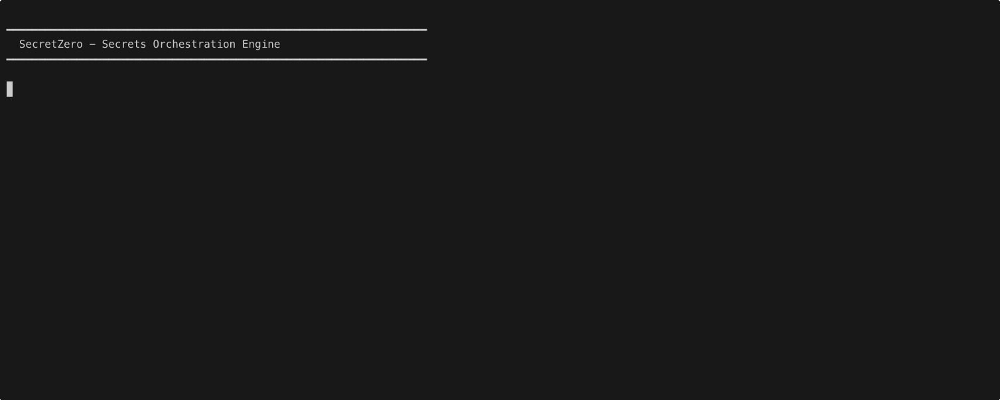
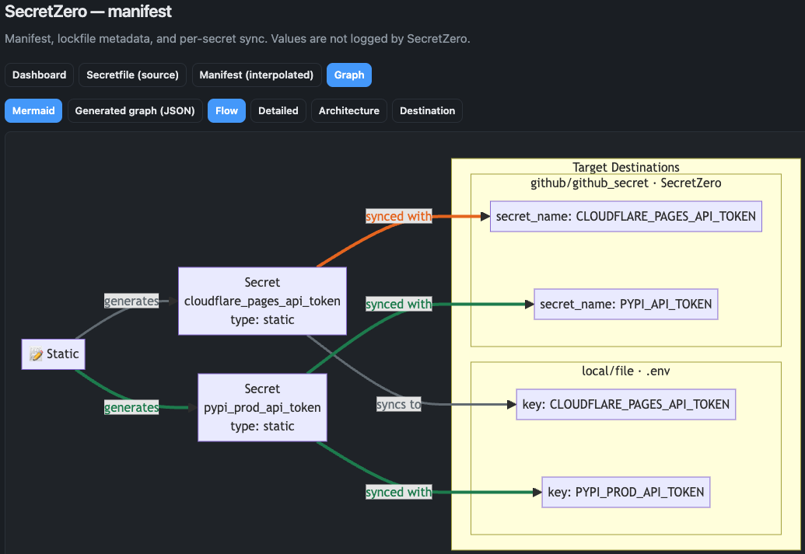
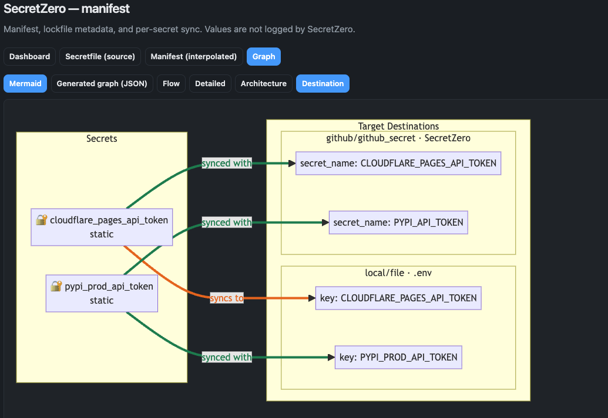
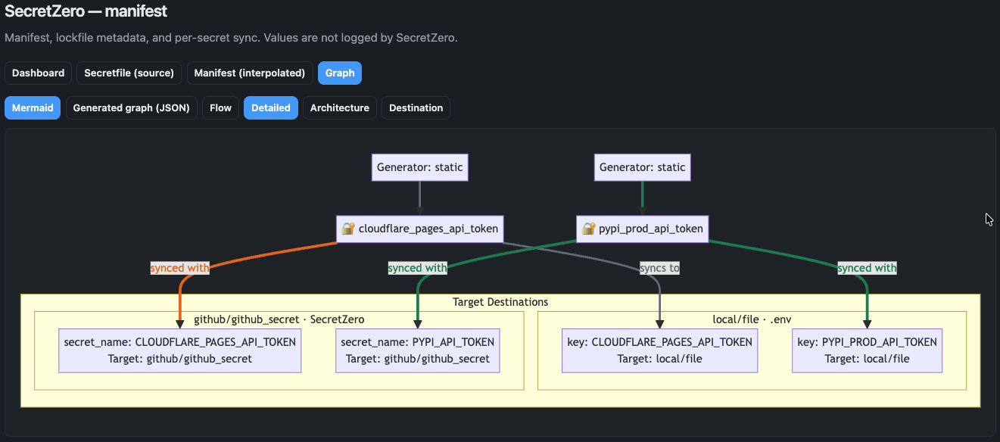

# SecretZero™
<div align="center">
<a href="https://secret0.com/">

</a>
</div>

<p align="center">
    <a href="https://github.com/zloeber/SecretZero/releases/latest">
        
    </a>
    <a href="https://github.com/zloeber/SecretZero/blob/main/LICENSE">
        
    </a>
    <a href="https://deepwiki.com/zloeber/SecretZero">
        
    </a>
    
    
    
    
    
</p>

SecretZero is a secrets as code management tool that automates the creation, seeding, and lifecycle management of project secrets through self-documenting declarative manifests. The very first secrets you seed for a new project or environment (known in the industry as 'secret-zero') are often the most difficult to track, maintain, seed, audit, and rotate. SecretZero aims to be an answer to this madness.

## Agent Quick Start

If you are an agent reading this repository remotely through `gh`, `curl`, or a GitHub/MCP client,
start here.

Skill files:

- `https://raw.githubusercontent.com/zloeber/SecretZero/main/skills/secretzero-agent/SKILL.md`
- `https://raw.githubusercontent.com/zloeber/SecretZero/main/skills/secretzero-author/SKILL.md`

Download both skill folders into a target directory:

```bash
curl -fsSL https://raw.githubusercontent.com/zloeber/SecretZero/main/scripts/download-secretzero-skills.zsh \
  | bash -s -- ./skills
```

Use that downloader like this:

- **OpenClaw:** download to `./skills` for the current workspace or `~/.agents/skills` for a
  shared install.
- **Hermes:** either install the raw `SKILL.md` URLs with `hermes skills install ...`, or
  download to `~/.agents/skills` (or another shared directory) and add that directory to
  `~/.hermes/config.yaml` under `skills.external_dirs`.

Direct Hermes install:

```bash
hermes skills install https://raw.githubusercontent.com/zloeber/SecretZero/main/skills/secretzero-agent/SKILL.md
hermes skills install https://raw.githubusercontent.com/zloeber/SecretZero/main/skills/secretzero-author/SKILL.md
```

## The Problem

If you have ever asked any of these questions about a new or existing codebase then SecretZero is for you!

- Where are all the secrets in my project?
- How do I generate new secrets, api keys, or certificates to deploy a whole new environment or application deployment?
- When were my critical project secrets last rotated?
- If I needed to bootstrap this entire project from scratch would I be able to do so without manually handling any secrets?
- How do I document my project's secrets surface area and requirements?

## Features

### Core Capabilities
- **Idempotent bootstrap** of initial secrets for one or more environments
- **Lockfile tracking** for secrets with rotation history and timestamps
- **Dual-purpose providers** that can both request/rotate new secrets and store them across a variety of environments
- **Type safety and validation** at every layer with strongly-typed Pydantic models
- **Variable interpolation and stacking** for targeting multiple environments independently
- **Manual secret fallbacks** via environment variables when automatic generation isn't possible
- **Self-documenting** secrets-as-code showing when secrets were created, from where, and where they are now

### Advanced Features
- **Secret Rotation Policies** - Automated rotation based on configurable time periods (90d, 2w, etc.)
- **Policy Enforcement** - Validate secrets against rotation, compliance, and access control policies
- **Compliance Support** - Built-in SOC2 and ISO27001 compliance policies
- **Drift Detection** - Detect when secrets have been modified outside of SecretZero's control
- **Rotation Tracking** - Track rotation history, count, and last rotation timestamp in lockfile
- **One-time Secrets** - Support for secrets that should only be generated once
- **Entra Agent ID Blueprint Orchestration** - Declaratively manage Entra agent identity blueprints and credential posture via Microsoft Graph
- **API** - Run as an API server if you need to for some reason I cannot fathom

`secretzero get` safety controls:
- `SZ_SANDBOX=true` blocks retrieval by default
- `SZ_ALLOW_GET_IN_SANDBOX=true` explicitly overrides the block
- `--reveal` is required to print plaintext values

## How It Works

At its core SecretZero is a declarative manifest that defines your secret usage in a project and automates requesting + seeding across targets while tracking state in a lockfile.

For end-to-end workflow diagrams and graph screenshots, see:

- [Workflow visuals](docs/getting-started/workflows.md)
- [Agent-guided secret sync](docs/user-guide/agent-sync.md)
- [Sync command reference](docs/user-guide/cli/sync.md)


## Use Cases

- GitOps-first infrastructure with git-friendly lockfiles for multi-environment secret provisioning.
- Multi-cloud secret synchronization across AWS Secrets Manager, Azure Key Vault, and HashiCorp Vault from a single source of truth.
- Database credential bootstrapping and rotation for PostgreSQL, MySQL, MongoDB, and similar systems.
- Certificate management for TLS certificates, SSH keypairs, and signing certificates across environments.
- CI/CD secret provisioning for GitHub Actions, GitLab CI, Jenkins, and related pipelines.
- Kubernetes secret seeding, including External Secrets Operator manifest generation for target secrets.
- Development environment setup so new team members can bootstrap local `.env` files without manual credential sharing.
- Compliance and audit workflows with lockfile history for SOC2 and ISO-style evidence.
- Secret-zero bootstrap for greenfield deployments and disaster recovery scenarios.
- API key lifecycle management for third-party services like Stripe, SendGrid, and Twilio.
- Microservices secret coordination for shared signing keys, encryption keys, and other distributed credentials.
- Environment parity testing with ephemeral environments that use production-like secrets without exposing real credentials.


# Components

These are the core components of this application.

## Secrets

Secrets are usually just a text or dict type. In our case we use a schema of allowed values so that we can easily map out a secret type when requesting it from the provider (kinda need to know what you are asking for right?). This is really a contract used for expected data from a provider and then expressed in targets.

> **NOTE** All secrets have a source and at least 1 or more targets.

## Providers

Providers are similar to terraform providers and are often an authentication point granting API access to secret sources or targets.

Secret sources are provider bound. If authentication fails, the user is (optionally) prompted for secrets manually as a failover. This is often necessary if there is a manual request somewhere in your bootstrap process.

## Installation

### Basic Installation

```bash
uv tool install -U "secretzero[all]"
```

### With Provider Support

```bash
# AWS support
uv tool install "secretzero[aws]"

# Azure support
uv tool install "secretzero[azure]"

# Entra Agent ID support
uv tool install "secretzero[entra_agent_id]"

# Vault support
uv tool install "secretzero[vault]"

# Kubernetes support
uv tool install "secretzero[kubernetes]"

# CI/CD support (GitHub, GitLab, Jenkins)
uv tool install "secretzero[cicd]"

# API server support
uv tool install "secretzero[api]"

# Everything (easiest)
uv tool install "secretzero[all]"
```

### Agent Skills

SecretZero ships two focused skills for agentic workflows:

- [`secretzero-agent`](./skills/secretzero-agent/SKILL.md) for runtime bootstrap, `agent sync`, and secure human-in-the-loop operations
- [`secretzero-author`](./skills/secretzero-author/SKILL.md) for `Secretfile.yml` authoring, review, and safe discovery workflows

For the fastest remote install path, see `Agent Quick Start` near the top of this README.

If you are a human operator, install SecretZero itself and use the skills as operating guides:

```bash
uv tool install -U "secretzero[all]"
secretzero --help
secretzero agent sync --help
```

If you are running Hermes Agent, install the skills directly from this repository:

```bash
hermes skills install https://raw.githubusercontent.com/zloeber/SecretZero/main/skills/secretzero-agent/SKILL.md
hermes skills install https://raw.githubusercontent.com/zloeber/SecretZero/main/skills/secretzero-author/SKILL.md
hermes skills list
```

If you already have a local checkout, you can also point Hermes at the repo skill directory in `~/.hermes/config.yaml`:

```yaml
skills:
  external_dirs:
    - /absolute/path/to/SecretZero/skills
```

If you are running OpenClaw, opening this repository as the agent workspace is enough because OpenClaw auto-loads workspace `/skills`. To make the skills available across all workspaces, copy them into `~/.agents/skills`:

```bash
mkdir -p ~/.agents/skills
cp -R skills/secretzero-agent ~/.agents/skills/
cp -R skills/secretzero-author ~/.agents/skills/
```

Or use the bundled downloader script from a remote agent session:

```bash
curl -fsSL https://raw.githubusercontent.com/zloeber/SecretZero/main/scripts/download-secretzero-skills.zsh \
  | bash -s -- ~/.agents/skills
```

## Installation (Development)

```bash
# Clone the repository
git clone https://github.com/zloeber/SecretZero.git
cd SecretZero

# Create virtual environment (include pip and other tools)
uv sync --all-extras
source .venv/bin/activate  # On Windows: .venv\Scripts\activate

# Install in development mode
uv uv tool install -e ".[dev]"
```

## Quick Start

### CLI Usage

```bash
# Start a one-time web interface
secretzero web

# Start a one-time web interface that targets the dev environment
secretzero web -e dev

# List supported secret types
secretzero secret-types

# Show detailed configuration for a specific type
secretzero secret-types --type password --verbose

# Create a new manifest from template
secretzero create --template-type basic

# Validate your manifest
secretzero validate

# Test provider connectivity
secretzero test

# Generate and sync secrets (dry-run)
secretzero sync --dry-run
```

### API Server

```bash
# Install API dependencies
uv tool install secretzero[api]

# Set API key (optional, enables authentication)
export SECRETZERO_API_KEY=$(python -c "import secrets; print(secrets.token_urlsafe(32))")

# Start server
secretzero-api

# Server runs on http://localhost:8000
# Visit http://localhost:8000/docs for interactive API documentation
```

### API Usage Examples

```bash
# Health check
curl http://localhost:8000/health

# List secrets (with authentication)
curl -H "X-API-Key: $SECRETZERO_API_KEY" http://localhost:8000/secrets

# Sync secrets
curl -X POST -H "X-API-Key: $SECRETZERO_API_KEY" \
  -H "Content-Type: application/json" \
  http://localhost:8000/sync \
  -d '{"dry_run": true, "force": false}'

# Check rotation status
curl -X POST -H "X-API-Key: $SECRETZERO_API_KEY" \
  -H "Content-Type: application/json" \
  http://localhost:8000/rotation/check \
  -d '{}'
```

For more API examples, see [docs/api-getting-started.md](docs/api-getting-started.md).

## Demo

See local `Secretfile.*.yml` files or other [local examples](./examples/). Here we run some of the commands against the local `Secretfile.yml` manifest:




## Pretty Graphs

### Secret Graph Overview



This view shows the top-level relationship between generated/resolved secrets and their targets.

### Sync State Across Targets



Edges reflect target sync state so you can quickly identify what is already synced versus pending/drifted.

### Destination-Centric View



## Documentation

- **[Docs](https://docs.secret0.com)**
- **[Extending SecretZero](./docs/extending.md)** - Guide for adding new secret types and providers

## Security

SecretZero is designed with security as a priority:

- ✅ No plaintext secrets in lock files (only metadata hashes)
- ✅ Schema-driven validation at every layer
- ✅ Type-safe implementations with Pydantic
- ✅ Idempotent operations to prevent accidental overwrites
- ✅ Audit trail through lock file tracking

# License

[Apache](./LICENSE)

# FAQs

## Relationship to External Secrets Operator

SecretZero is designed to complement, not replace, the External Secrets Operator. 

SecretZero manages secret creation, bootstrap, lifecycle, and auditability upstream, while External Secrets handles runtime projection into Kubernetes.

## Relationship to <Vault|Infiscal|Others>

A secrets management solution like Infisical is a strong control plane for secret storage and policy. SecretZero compliments this and other secrets solutions by adding deterministic orchestration and cross-provider lifecycle modeling. SecretZero maps out the secrets from inception to usage and beyond regardless of the backend secrets platforms in place.