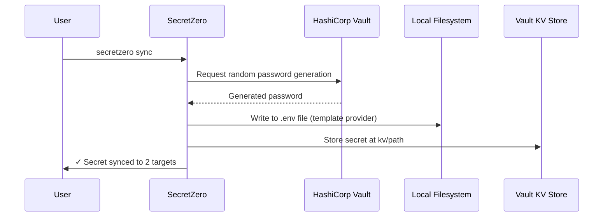
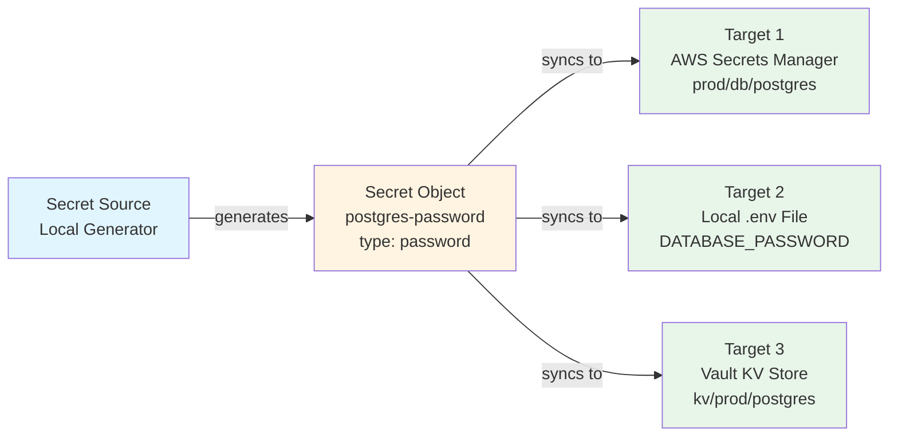
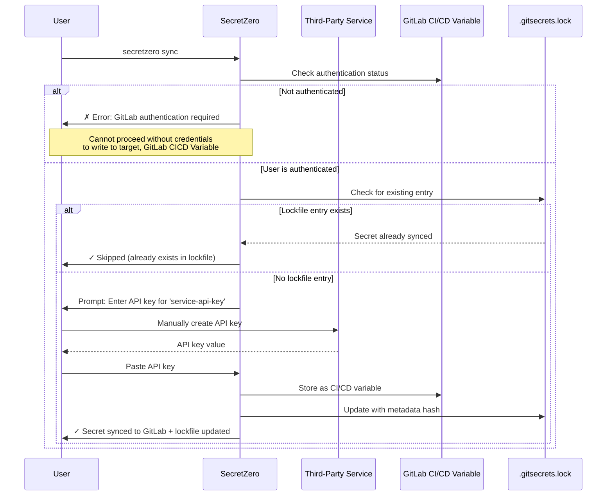
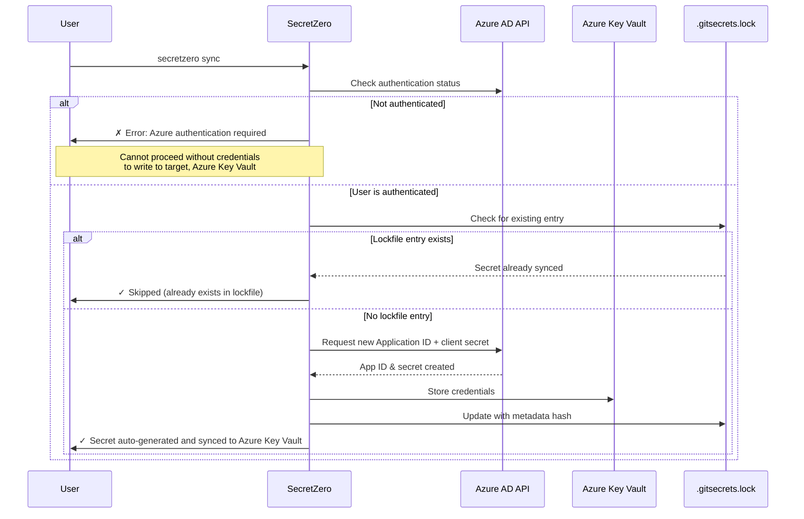
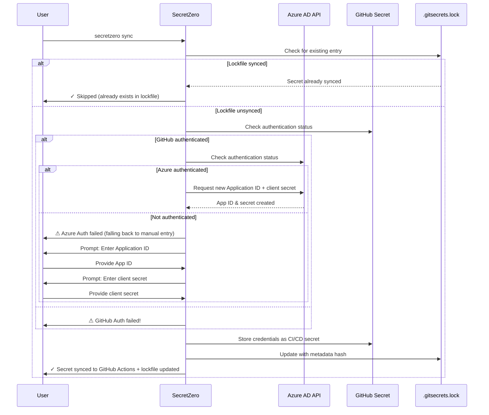

# SecretZero

SecretZero is a secrets orchestration, lifecycle, and bootstrap engine, not a secret database.

Think of it as:
	•	Terraform for secrets lifecycle
	•	Renovate for credentials
	•	NPM/Yarn for secret dependencies
	•	A lockfile for compliance

SecretZero is a secrets management tool that automates the creation, seeding, and lifecycle management of project secrets through a declarative, schema-driven workflow. SecretZero streamlines secret zero bootstrap processes and their future rotation making project bootstrapping and multi-environment deployments a breeze. 

## The Problem

If you have ever asked any of these questions about a new or existing codebase then SecretZero is for you!

- Where are all the secrets in my project?
- How do I generate new secrets, api keys, or certificates to deploy a whole new environment?
- How do I handle secret-zero?
- When were my critical project secrets last rotated?
- If I needed to bootstrap this entire project from scratch would I be able to do so without manually handling any secrets?
- How do I document my project's secrets surface area and requirements?

## Features

- Idempotent bootstrap of initial secrets for one or more environments
- A lockfile for your secrets handling
- Dual-purpose providers that can both request/rotate new secrets and store them across a variety of environments.
- Can be used enforce idempotency, auditability, and multi-target deployment patterns while maintaining strict type safety and validation at every layer.
- Multiple profiles for targeting multiple environments independently.
- If a secret cannot be automatically generated it can still be managed via manual prompts or environment variables when being generated (Think remote site API keys or existing secrets you need to start tracking).
- Self-documenting secrets-as-code for your project that shows when secrets were created, from where, and where they are now.

## How It Works

At its core SecretZero is a declarative manifest that defines your secret usage in a project then does its very best to help you request and seed your secrets. It is like a package dependency list but for your secrets. SecretZero processes a simple declarative configuration file in your project that lays out where your secrets come from and where they need to go. 


A user with all the correctly authenticated providers can run 'secretzero sync' to bootstrap the environment from scratch. SecretZero will validate if the environment has already been bootstrapped (lockfile) and attempt to automate requesting and storing them. In it's simplest form, you can use the local system to generate random passwords for you then store them into AWS Secrets Manager, A local .env file, Azure KeyVault, Kubernetes Secret, or Vault KV store.

SecretZero is composed of providers and secret types. Providers determine where you can request secrets from and how they can be stored. These are typically associated with an authenticated platform such as AWS, Azure, HashiCorp Vault, or external API endpoints. Secret types are expected secret formats such as generic random passwords, api tokens, database credentials, ssh keys, certificates, or more. Below is an ideal workflow without the details of authentication.



Here is a more complex example workflow for a randomly generated initial database credential that then gets stored in a local .env file, aws secret manager secret, and Hashicorp Vault KV store:



Here is the sequence of events for a developer that needs to maintain a manually requested API key for their project using SecretZero to help bootstrap and create a lockfile for the process thus tracking and timestamping the process for future rotation.


Here is the sequence of events for a developer that needs to maintain an Azure Application ID credential for their project using SecretZero. Authentication is required to both request the credential via Azure API and store it in Azure Key Vault. If possible SecretZero providers will attempt to automatically request secrets. If that request fails then it fails back to manual prompting.


Here is the sequence of events for a developer that needs to maintain an Azure Application ID credential for their project using SecretZero. Authentication is required to request the credential via Azure API. If Azure authentication fails, SecretZero falls back to manual credential entry. The credentials are then stored as a GitHub CI/CD secret that the user is authenticated against.



## Auto-Authentication

Not shown in the above workflows are the fact that SecretZero will attempt to also automatically authenticate via OIDC, environment variables, or whichever manner the provider is able to support.

## Use Cases

### GitOps-First Infrastructure

Easy to read lockfiles are 100% git friendly. Perfect for teams deploying infrastructure via GitOps where secrets need automated provisioning across multiple environments without manual intervention.

### Multi-Cloud Secret Synchronization

Sync secrets across AWS Secrets Manager, Azure Key Vault, and HashiCorp Vault simultaneously from a single source of truth.

### Database Credential Bootstrapping

Generate and rotate database credentials (PostgreSQL, MySQL, MongoDB) during initial deployment or scheduled rotation cycles.

### Certificate Management

Automate creation and distribution of TLS certificates, SSH keypairs, and signing certificates across development, staging, and production environments.

### CI/CD Secret Provisioning

Bootstrap CI/CD pipeline secrets (GitHub Actions, GitLab CI, Jenkins) from centralized configuration without storing credentials in version control.

### Kubernetes Secret Seeding

Generate and deploy secrets to multiple Kubernetes clusters/namespaces during cluster initialization or application deployment.
- Generate externals secrets operator manifests for target secrets.

### Development Environment Setup

New team members can bootstrap their local `.env` files with production-like secrets in seconds without manual credential sharing.

### Compliance & Audit Requirements

Maintain an auditable lockfile showing when secrets were created, last rotated, and where they're deployed for SOC2/ISO compliance.

### Secret-Zero Problem

Solve the "where do the first secrets come from" challenge when deploying greenfield infrastructure or disaster recovery scenarios.

### API Key Lifecycle Management

Track and rotate third-party API keys (Stripe, SendGrid, Twilio) across multiple services while maintaining synchronization.

### Microservices Secret Coordination

Ensure all microservices receive consistent shared secrets (JWT signing keys, encryption keys) across distributed deployments.

### Environment Parity Testing

Quickly spin up ephemeral test environments with production-like secrets for integration testing without exposing real credentials.


# Components

These are the core components of this application.

## Secrets

Secrets are usually just a text or dict type. In our case we use a schema of allowed values so that we can easily map out a secret type when requesting it from the provider (kinda need to know what you are asking for right?). This is really a contract used for expected data from a provider and then expressed in targets.

> **NOTE** All secrets have a source and at least 1 or more targets.

## Providers

Providers are similar to terraform providers and are often an authentication point granting API access to secret sources or targets.

Secret sources are provider bound. If authentication fails, the user is (optionally) prompted for secrets manually as a failover. This is often necessary if there is a manual request somewhere in your bootstrap process.

## Installation (Development)

```bash
# Clone the repository
git clone https://github.com/zloeber/SecretZero.git
cd SecretZero

# Create virtual environment
uv sync
source .venv/bin/activate  # On Windows: .venv\Scripts\activate

# Install in development mode
uv pip install -e ".[dev]"
```

## Quick Start

```bash
# List supported secret types
secretzero secret-types

# Show detailed configuration for a specific type
secretzero secret-types --type password --verbose

# Create a new manifest from template
secretzero init --template-type basic

# Validate your manifest
secretzero validate

# Test provider connectivity
secretzero test

# Generate and sync secrets (dry-run)
secretzero sync --dry-run

# Actually create and deploy secrets
secretzero sync
```

## Example Manifest

** See [Secretfile.yml](./Secretfile.yml) **

## Documentation

- **[Docs][./docs]**
- **[Extending SecretZero](./docs/extending.md)** - Guide for adding new secret types and providers

## Security

SecretZero is designed with security as a priority:

- ✅ No plaintext secrets in lock files (only metadata hashes)
- ✅ Schema-driven validation at every layer
- ✅ Type-safe implementations with Pydantic
- ✅ Idempotent operations to prevent accidental overwrites
- ✅ Audit trail through lock file tracking

## License

[Apache](./LICENSE)

# FAQ

## Relationship to External Secrets Operator

SecretZero is designed to complement, not replace, the External Secrets Operator.

SecretZero manages secret creation, bootstrap, lifecycle, and auditability upstream, while External Secrets handles runtime projection into Kubernetes.
