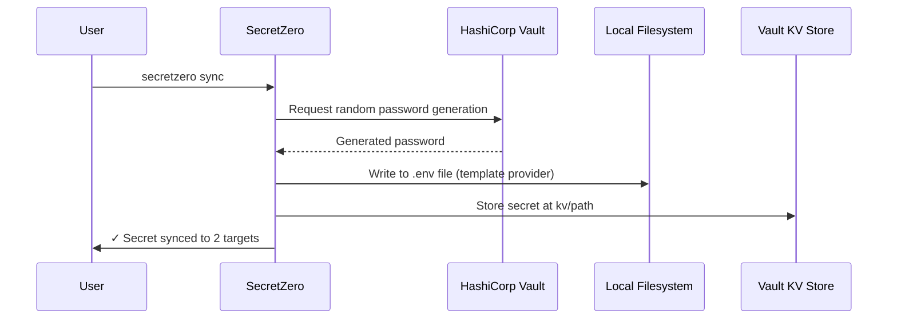
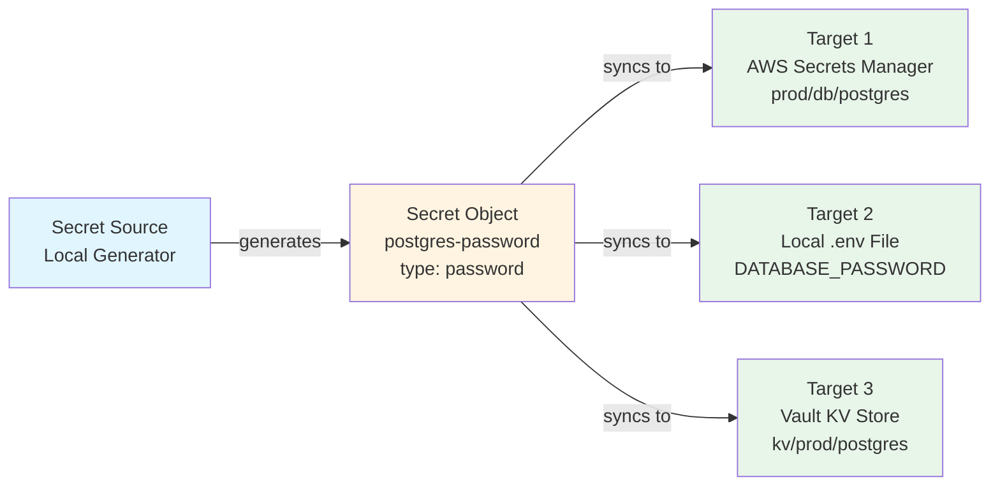
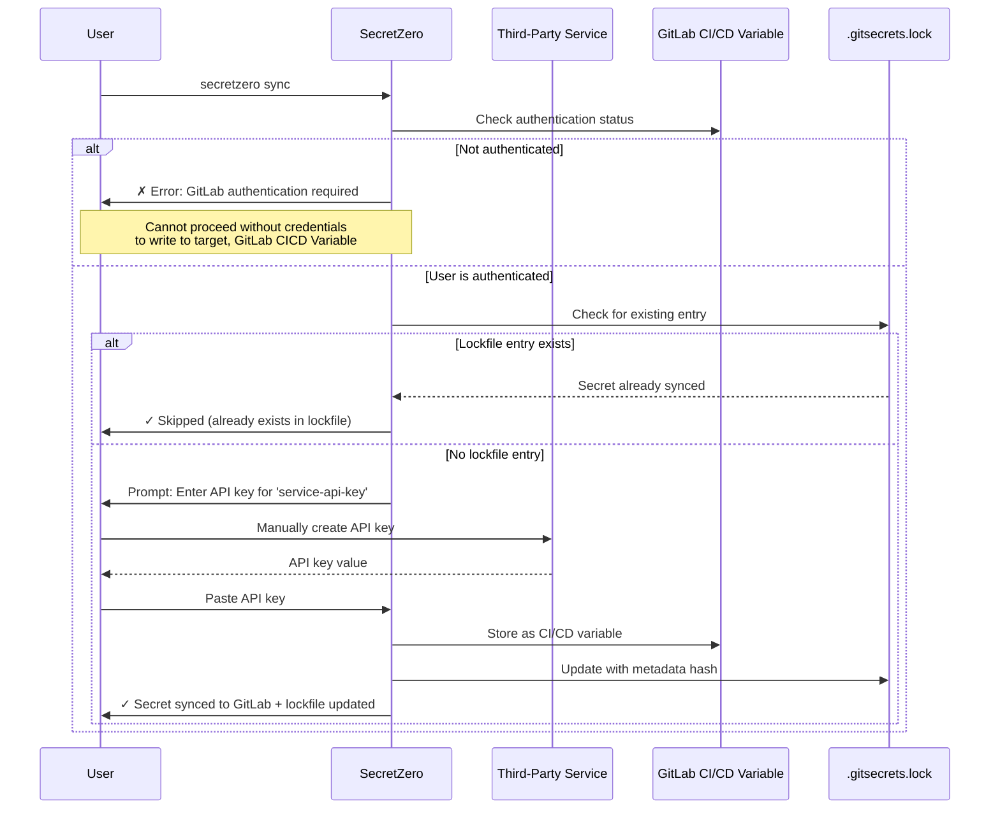
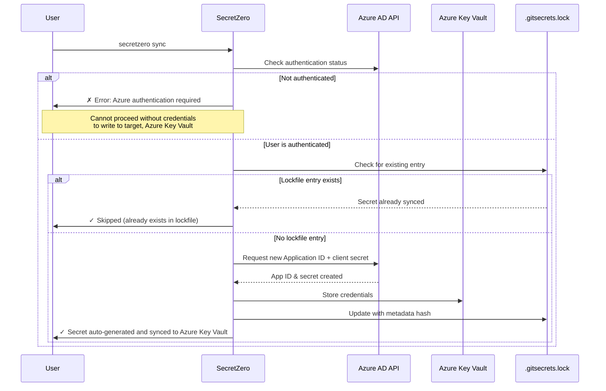
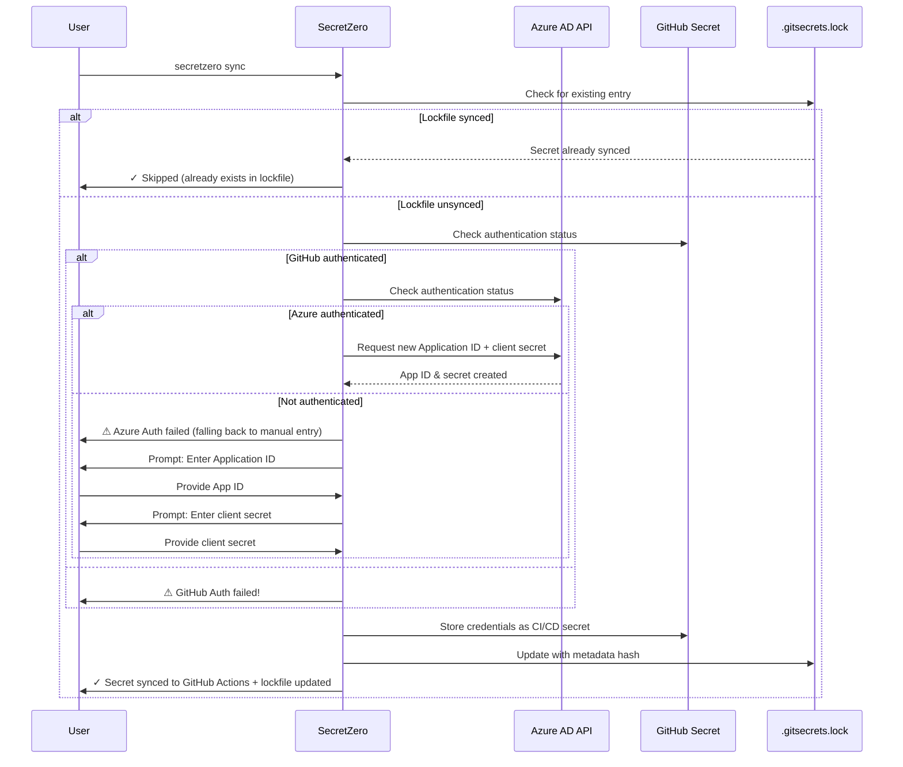
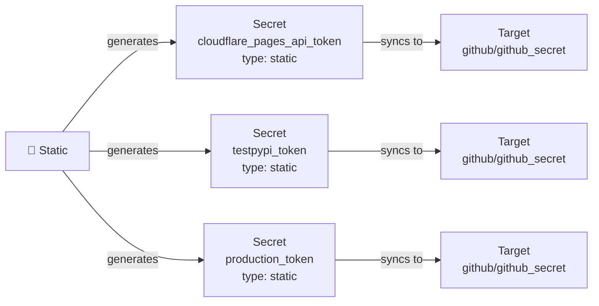

# SecretZero

SecretZero is a secrets orchestration, lifecycle, and bootstrap engine.


SecretZero is a secrets as code management tool that automates the creation, seeding, and lifecycle management of project secrets through self-documenting declarative manifests. The very first secrets you seed for a new project or environment (known in the industry as 'secret-zero') are often the most difficult to track, maintain, seed, audit, and rotate. SecretZero aims to be an answer to this madness.

## The Problem

If you have ever asked any of these questions about a new or existing codebase then SecretZero is for you!

- Where are all the secrets in my project?
- How do I generate new secrets, api keys, or certificates to deploy a whole new environment?
- How do I handle secret-zero?
- When were my critical project secrets last rotated?
- If I needed to bootstrap this entire project from scratch would I be able to do so without manually handling any secrets?
- How do I document my project's secrets surface area and requirements?

## Features

### Core Capabilities
- **Idempotent bootstrap** of initial secrets for one or more environments
- **Lockfile tracking** for secrets with rotation history and timestamps
- **Dual-purpose providers** that can both request/rotate new secrets and store them across a variety of environments
- **Type safety and validation** at every layer with strongly-typed Pydantic models
- **Variable interpolation and stacking** for targeting multiple environments independently
- **Manual secret fallbacks** via environment variables when automatic generation isn't possible
- **Self-documenting** secrets-as-code showing when secrets were created, from where, and where they are now

### Advanced Features
- **Secret Rotation Policies** - Automated rotation based on configurable time periods (90d, 2w, etc.)
- **Policy Enforcement** - Validate secrets against rotation, compliance, and access control policies
- **Compliance Support** - Built-in SOC2 and ISO27001 compliance policies
- **Drift Detection** - Detect when secrets have been modified outside of SecretZero's control
- **Rotation Tracking** - Track rotation history, count, and last rotation timestamp in lockfile
- **One-time Secrets** - Support for secrets that should only be generated once

### API Service
- **REST API** - FastAPI-based HTTP API for programmatic secret management
- **OpenAPI Documentation** - Interactive API docs with Swagger UI and ReDoc
- **API Authentication** - Secure API key-based authentication
- **Audit Logging** - Comprehensive audit trail for all API operations
- **Remote Management** - Manage secrets from CI/CD pipelines, scripts, or applications

### CLI Commands
```bash
# Initialize and validate
secretzero create                    # Create new Secretfile from template
secretzero init                      # Check and install provider dependencies
secretzero validate                # Validate Secretfile configuration
secretzero test                    # Test provider connectivity

# Secret management
secretzero sync                    # Generate and sync secrets to targets
secretzero sync --dry-run         # Preview changes without applying
secretzero sync -s db_password    # Sync only specific secret(s)
secretzero show '<secret>'          # Show secret metadata

# Visualization
secretzero graph                   # Generate visual flow diagram
secretzero graph --type detailed  # Show detailed configuration
secretzero graph --type architecture  # Show system architecture
secretzero graph --format terminal    # Text-based summary
secretzero graph --output diagram.md  # Save to file

# Rotation and policies
secretzero rotate                  # Rotate secrets based on policies
secretzero rotate --dry-run       # Preview rotation status
secretzero rotate --force         # Force rotation even if not due
secretzero policy                  # Check policy compliance
secretzero drift                   # Detect drift in secrets

# Provider management
secretzero providers list          # List available providers
secretzero providers capabilities  # Show provider capabilities
secretzero providers token-info    # Show GitHub token permissions
secretzero providers token-info --provider github  # Explicit provider

# API Server
secretzero-api                     # Start REST API server
```

### API Endpoints
```bash
# Health and documentation
GET  /                             # API info
GET  /health                       # Health check
GET  /docs                         # Interactive Swagger UI
GET  /redoc                        # ReDoc documentation

# Secret management
GET  /secrets                      # List all secrets
GET  /secrets/{name}/status        # Get secret status
POST /sync                         # Sync/generate secrets
POST /config/validate              # Validate configuration

# Rotation and policies
POST /rotation/check               # Check rotation status
POST /rotation/execute             # Execute rotation
POST /policy/check                 # Check policy compliance
POST /drift/check                  # Check for drift

# Audit and monitoring
GET  /audit/logs                   # Get audit logs
```

## How It Works

At its core SecretZero is a declarative manifest that defines your secret usage in a project then does its very best to help you request and seed your secrets. It is like a package dependency list but for your secrets. SecretZero processes a simple declarative configuration file in your project that lays out where your secrets come from and where they need to go. 

A user with all the correctly authenticated providers can run 'secretzero sync' to bootstrap the environment from scratch. SecretZero will validate if the environment has already been bootstrapped (lockfile) and attempt to automate requesting and storing them. In it's simplest form, you can use the local system to generate random passwords for you then store them into AWS Secrets Manager, A local .env file, Azure KeyVault, Kubernetes Secret, or Vault KV store.

SecretZero is composed of providers and secret types. Providers determine where you can request secrets from and how they can be stored. These are typically associated with an authenticated platform such as AWS, Azure, HashiCorp Vault, or external API endpoints. Secret types are expected secret formats such as generic random passwords, api tokens, database credentials, ssh keys, certificates, or more. Below is an ideal workflow without the details of authentication.



Here is a more complex example workflow for a randomly generated initial database credential that then gets stored in a local .env file, aws secret manager secret, and Hashicorp Vault KV store:



Here is the sequence of events for a developer that needs to maintain a manually requested API key for their project using SecretZero to help bootstrap and create a lockfile for the process thus tracking and timestamping the process for future rotation.


Here is the sequence of events for a developer that needs to maintain an Azure Application ID credential for their project using SecretZero. Authentication is required to both request the credential via Azure API and store it in Azure Key Vault. If possible SecretZero providers will attempt to automatically request secrets. If that request fails then it fails back to manual prompting.


Here is the sequence of events for a developer that needs to maintain an Azure Application ID credential for their project using SecretZero. Authentication is required to request the credential via Azure API. If Azure authentication fails, SecretZero falls back to manual credential entry. The credentials are then stored as a GitHub CI/CD secret that the user is authenticated against.



### Checking Provider Permissions

SecretZero can introspect provider authentication tokens to verify they have the necessary permissions:

```bash
# Check GitHub token permissions and scopes
secretzero providers token-info

# Output shows:
# - User information
# - OAuth scopes (repo, workflow, admin:org, etc.)
# - Capabilities (can read repos, write secrets, etc.)
# - Links to documentation on permission requirements
```

This is useful for:
- **Troubleshooting** - Verify token has required scopes before attempting operations
- **Security auditing** - Document what permissions are granted to tokens
- **Compliance** - Ensure tokens follow principle of least privilege
- **Onboarding** - Help new team members create tokens with correct permissions

Currently supported providers: GitHub (more providers coming soon).

## Use Cases

### GitOps-First Infrastructure

Easy to read lockfiles are 100% git friendly. Perfect for teams deploying infrastructure via GitOps where secrets need automated provisioning across multiple environments without manual intervention.

### Multi-Cloud Secret Synchronization

Sync secrets across AWS Secrets Manager, Azure Key Vault, and HashiCorp Vault simultaneously from a single source of truth.

### Database Credential Bootstrapping

Generate and rotate database credentials (PostgreSQL, MySQL, MongoDB) during initial deployment or scheduled rotation cycles.

### Certificate Management

Automate creation and distribution of TLS certificates, SSH keypairs, and signing certificates across development, staging, and production environments.

### CI/CD Secret Provisioning

Bootstrap CI/CD pipeline secrets (GitHub Actions, GitLab CI, Jenkins) from centralized configuration without storing credentials in version control.

### Kubernetes Secret Seeding

Generate and deploy secrets to multiple Kubernetes clusters/namespaces during cluster initialization or application deployment.
- Generate externals secrets operator manifests for target secrets.

### Development Environment Setup

New team members can bootstrap their local `.env` files with production-like secrets in seconds without manual credential sharing.

### Compliance & Audit Requirements

Maintain an auditable lockfile showing when secrets were created, last rotated, and where they're deployed for SOC2/ISO compliance.

### Secret-Zero Problem

Solve the "where do the first secrets come from" challenge when deploying greenfield infrastructure or disaster recovery scenarios.

### API Key Lifecycle Management

Track and rotate third-party API keys (Stripe, SendGrid, Twilio) across multiple services while maintaining synchronization.

### Microservices Secret Coordination

Ensure all microservices receive consistent shared secrets (JWT signing keys, encryption keys) across distributed deployments.

### Environment Parity Testing

Quickly spin up ephemeral test environments with production-like secrets for integration testing without exposing real credentials.


# Components

These are the core components of this application.

## Secrets

Secrets are usually just a text or dict type. In our case we use a schema of allowed values so that we can easily map out a secret type when requesting it from the provider (kinda need to know what you are asking for right?). This is really a contract used for expected data from a provider and then expressed in targets.

> **NOTE** All secrets have a source and at least 1 or more targets.

## Providers

Providers are similar to terraform providers and are often an authentication point granting API access to secret sources or targets.

Secret sources are provider bound. If authentication fails, the user is (optionally) prompted for secrets manually as a failover. This is often necessary if there is a manual request somewhere in your bootstrap process.

## Installation

### Basic Installation

```bash
uv tool install secretzero
```

### With Provider Support

```bash
# AWS support
uv tool install secretzero[aws]

# Azure support
uv tool install secretzero[azure]

# Vault support
uv tool install secretzero[vault]

# Kubernetes support
uv tool install secretzero[kubernetes]

# CI/CD support (GitHub, GitLab, Jenkins)
uv tool install secretzero[cicd]

# API server support
uv tool install secretzero[api]

# Everything
uv tool install secretzero[all]
```

## Installation (Development)

```bash
# Clone the repository
git clone https://github.com/zloeber/SecretZero.git
cd SecretZero

# Create virtual environment (include pip and other tools)
uv sync --all-extras
source .venv/bin/activate  # On Windows: .venv\Scripts\activate

# Install in development mode
uv uv tool install -e ".[dev]"
```

## Quick Start

### CLI Usage

```bash
# List supported secret types
secretzero secret-types

# Show detailed configuration for a specific type
secretzero secret-types --type password --verbose

# Create a new manifest from template
secretzero create --template-type basic

# Validate your manifest
secretzero validate

# Test provider connectivity
secretzero test

# Generate and sync secrets (dry-run)
secretzero sync --dry-run
```

### API Server

```bash
# Install API dependencies
uv tool install secretzero[api]

# Set API key (optional, enables authentication)
export SECRETZERO_API_KEY=$(python -c "import secrets; print(secrets.token_urlsafe(32))")

# Start server
secretzero-api

# Server runs on http://localhost:8000
# Visit http://localhost:8000/docs for interactive API documentation
```

### API Usage Examples

```bash
# Health check
curl http://localhost:8000/health

# List secrets (with authentication)
curl -H "X-API-Key: $SECRETZERO_API_KEY" http://localhost:8000/secrets

# Sync secrets
curl -X POST -H "X-API-Key: $SECRETZERO_API_KEY" \
  -H "Content-Type: application/json" \
  http://localhost:8000/sync \
  -d '{"dry_run": true, "force": false}'

# Check rotation status
curl -X POST -H "X-API-Key: $SECRETZERO_API_KEY" \
  -H "Content-Type: application/json" \
  http://localhost:8000/rotation/check \
  -d '{}'
```

For more API examples, see [docs/api-getting-started.md](docs/api-getting-started.md).

## Demo

See local `Secretfile.*.yml` files or other [local examples](./examples/). Here we run some of the commands against the local `Secretfile.yml` manifest:


Below is the generated mermaid diagram from the above demonstration.



## Documentation

- **[Docs][https://docs.secret0.com]**
- **[Extending SecretZero](./docs/extending.md)** - Guide for adding new secret types and providers

## Security

SecretZero is designed with security as a priority:

- ✅ No plaintext secrets in lock files (only metadata hashes)
- ✅ Schema-driven validation at every layer
- ✅ Type-safe implementations with Pydantic
- ✅ Idempotent operations to prevent accidental overwrites
- ✅ Audit trail through lock file tracking

# Roadmap

Here are some features I'd like to add to this project.

## Better OIDC Support

I'd like to more easily support automatic authentication via OIDC for interactive sessions. I'll include a `--auto-auth` prompt that will attempt to do automated OIDC based authentication with providers by popping open oidc web pages and walking the user through authenticating.

## Customized Secret Types and Generator Output.

These would be tied to a provider specifically for things like generating a PAT or API tokens via their API. In cases where the secret cannot be generated and the user enters a static secret then a custom provider generator should be able to provide their own explicit instructions on attaining the api key (for example).

## Non-Secret Handling

Secrets are often meaningless without the context of multiple non-secret variables. Currently we allow these non-secrets as standard parts of a multi-part secret. They need only be set to static with a default value. Instead I'd like to allow for these values to exist as both a source and target within a secret definition as a secret type of 'local' or 'nonsecret'. These are put into the lockfile alongside any other secrets but require no targets and will not prompt a user for values unless explicitly passing in an option to force the prompt for these values like static secrets. In this situation I'd like to explore allowing for the secret source to be a json, env, or other configuration file that contains an environment's additional non-secret keys with their values.

# License

[Apache](./LICENSE)

# FAQs

## Relationship to External Secrets Operator

SecretZero is designed to complement, not replace, the External Secrets Operator. 

SecretZero manages secret creation, bootstrap, lifecycle, and auditability upstream, while External Secrets handles runtime projection into Kubernetes.

## Relationship to [Vault|Infiscal|Others]

A secrets management solution like Infisical is a strong control plane for secret storage and policy. SecretZero compliments this and other secrets solutions by adding deterministic orchestration and cross-provider lifecycle modeling. SecretZero simply maps out the secrets from inception to usage and beyond.