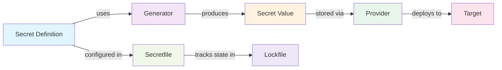

# Development

Use this entrypoint for most common development tasks.


## Architecture



**Flow:**
- **Secret Definition**: Declarative configuration of what secret to manage
- **Generator**: Algorithm that creates the secret value (random_password, static, api, script)
- **Secret Value**: The actual generated credentials or keys
- **Provider**: Source/retrieval mechanism (Vault, AWS KMS, Azure Key Vault)
- **Target**: Destination where secrets are deployed (files, Kubernetes, GitHub, GitLab, CI/CD systems)
- **Secretfile**: YAML configuration declaring all secrets and their lifecycle
- **Lockfile**: YAML tracking secret state, rotation history, and metadata

## Adding a New Provider
### Step 1: Create Provider Class

Create `src/secretzero/providers/my_provider.py`:

```python
from pydantic import BaseModel, Field
from secretzero.providers.base import BaseProvider

class MyProviderConfig(BaseModel):
    """Configuration for MyProvider."""
    endpoint: str = Field(description="Provider endpoint URL")
    api_key: str = Field(description="Authentication API key")
    timeout: int = Field(default=30, gt=0)

class MyProvider(BaseProvider):
    """Provider for MyService."""
    
    config: MyProviderConfig
    
    @property
    def provider_kind(self) -> str:
        return "my_provider"
    
    def validate_connection(self) -> bool:
        """Test connectivity to provider."""
        try:
            # Implement connection test
            return True
        except Exception:
            return False
    
    def get_secret(self, secret_name: str) -> str:
        """Retrieve secret value from provider."""
        # Make API call to retrieve secret
        pass
    
    def store_secret(self, secret_name: str, secret_value: str) -> None:
        """Store secret value in provider (optional)."""
        pass
```

### Step 2: Register Provider

Add to `src/secretzero/providers/__init__.py`:

```python
from secretzero.providers.my_provider import MyProvider, MyProviderConfig

__all__ = ["MyProvider", "MyProviderConfig"]
```

### Step 3: Write Tests

Create `tests/test_my_provider.py`:

```python
import pytest
from secretzero.providers.my_provider import MyProvider, MyProviderConfig

def test_provider_validates_connection():
    """Test provider validates connectivity."""
    config = MyProviderConfig(endpoint="http://test", api_key="test")
    provider = MyProvider(config=config)
    assert isinstance(provider.validate_connection(), bool)

def test_provider_retrieves_secret():
    """Test provider retrieves secrets."""
    provider = MyProvider(config=valid_config)
    secret = provider.get_secret("test_secret")
    assert isinstance(secret, str)
```

### Step 4: Update Documentation

- Add provider to `docs/providers/my_provider.md`
- Update `Secretfile.schema.json` with provider configuration schema
- Add example to `examples/secretfile_my_provider.yaml`


## Adding a New Secret Type

## Adding a New Generator

## Adding a New Target
