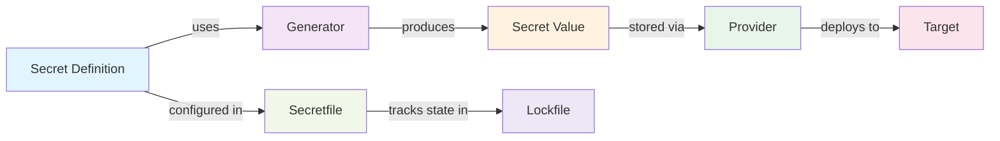

# Development

Use this entrypoint for most common development tasks.


## Architecture



**Flow:**
- **Secret Definition**: Declarative configuration of what secret to manage
- **Generator**: Algorithm that creates the secret value (random_password, static, api, script)
- **Secret Value**: The actual generated credentials or keys
- **Provider**: Source/retrieval mechanism (Vault, AWS KMS, Azure Key Vault)
- **Target**: Destination where secrets are deployed (files, Kubernetes, GitHub, GitLab, CI/CD systems)
- **Secretfile**: YAML configuration declaring all secrets and their lifecycle
- **Lockfile**: YAML tracking secret state, rotation history, and metadata

## Adding a New Provider
### Step 1: Create Provider Class

Create `src/secretzero/providers/my_provider.py`:

```python
from pydantic import BaseModel, Field
from secretzero.providers.base import BaseProvider

class MyProviderConfig(BaseModel):
    """Configuration for MyProvider."""
    endpoint: str = Field(description="Provider endpoint URL")
    api_key: str = Field(description="Authentication API key")
    timeout: int = Field(default=30, gt=0)

class MyProvider(BaseProvider):
    """Provider for MyService."""
    
    config: MyProviderConfig
    
    @property
    def provider_kind(self) -> str:
        return "my_provider"
    
    def validate_connection(self) -> bool:
        """Test connectivity to provider."""
        try:
            # Implement connection test
            return True
        except Exception:
            return False
    
    def get_secret(self, secret_name: str) -> str:
        """Retrieve secret value from provider."""
        # Make API call to retrieve secret
        pass
    
    def store_secret(self, secret_name: str, secret_value: str) -> None:
        """Store secret value in provider (optional)."""
        pass
```

### Step 2: Register Provider

Add to `src/secretzero/providers/__init__.py`:

```python
from secretzero.providers.my_provider import MyProvider, MyProviderConfig

__all__ = ["MyProvider", "MyProviderConfig"]
```

### Step 3: Write Tests

Create `tests/test_my_provider.py`:

```python
import pytest
from secretzero.providers.my_provider import MyProvider, MyProviderConfig

def test_provider_validates_connection():
    """Test provider validates connectivity."""
    config = MyProviderConfig(endpoint="http://test", api_key="test")
    provider = MyProvider(config=config)
    assert isinstance(provider.validate_connection(), bool)

def test_provider_retrieves_secret():
    """Test provider retrieves secrets."""
    provider = MyProvider(config=valid_config)
    secret = provider.get_secret("test_secret")
    assert isinstance(secret, str)
```

### Step 4: Update Documentation

- Add provider to `docs/providers/my_provider.md`
- Update `Secretfile.schema.json` with provider configuration schema
- Add example to `examples/secretfile_my_provider.yaml`

## Adding a New Generator

### Step 1: Create Generator Class

Create `src/secretzero/generators/my_generator.py`:

```python
from pydantic import BaseModel, Field
from secretzero.generators.base import BaseGenerator

class MyGeneratorConfig(BaseModel):
    """Configuration for MyGenerator."""
    length: int = Field(default=32, gt=0, description="Generated value length")
    custom_param: str = Field(default="default", description="Custom parameter")

class MyGenerator(BaseGenerator):
    """Generate secrets using custom algorithm."""
    
    config: MyGeneratorConfig
    
    @property
    def generator_kind(self) -> str:
        return "my_generator"
    
    def generate(self) -> str:
        """Generate a new secret value."""
        # Implement generation logic
        pass
```

### Step 2: Register Generator

Add to `src/secretzero/generators/__init__.py`:

```python
from secretzero.generators.my_generator import MyGenerator, MyGeneratorConfig

__all__ = ["MyGenerator", "MyGeneratorConfig"]
```

### Step 3: Write Tests

Create `tests/test_my_generator.py`:

```python
import pytest
from secretzero.generators.my_generator import MyGenerator, MyGeneratorConfig

def test_generator_produces_output():
    """Test generator produces valid output."""
    config = MyGeneratorConfig(length=32)
    generator = MyGenerator(config=config)
    secret = generator.generate()
    assert isinstance(secret, str)
    assert len(secret) == 32

def test_generator_respects_config():
    """Test generator respects configuration parameters."""
    config = MyGeneratorConfig(length=16, custom_param="test")
    generator = MyGenerator(config=config)
    secret = generator.generate()
    assert len(secret) == 16
```

### Step 4: Update Documentation

- Add generator to `docs/generators/my_generator.md`
- Update `Secretfile.schema.json` with generator configuration
- Add example usage to `examples/secretfile_generators.yaml`

## Adding a New Target

### Step 1: Create Target Class

Create `src/secretzero/targets/my_target.py`:

```python
from pydantic import BaseModel, Field
from secretzero.targets.base import BaseTarget

class MyTargetConfig(BaseModel):
    """Configuration for MyTarget."""
    path: str = Field(description="Target location or identifier")
    format: str = Field(default="json", description="Output format")
    overwrite: bool = Field(default=True, description="Overwrite existing secrets")

class MyTarget(BaseTarget):
    """Target for storing secrets in MyService."""
    
    config: MyTargetConfig
    
    @property
    def target_kind(self) -> str:
        return "my_target"
    
    def deploy(self, secrets: dict[str, str]) -> None:
        """Deploy secrets to target."""
        # Implement deployment logic
        pass
    
    def verify(self) -> bool:
        """Verify secrets are correctly deployed."""
        # Implement verification logic
        return True
```

### Step 2: Register Target

Add to `src/secretzero/targets/__init__.py`:

```python
from secretzero.targets.my_target import MyTarget, MyTargetConfig

__all__ = ["MyTarget", "MyTargetConfig"]
```

### Step 3: Write Tests

Create `tests/test_my_target.py`:

```python
import pytest
from secretzero.targets.my_target import MyTarget, MyTargetConfig

def test_target_deploys_secrets(tmp_path):
    """Test target deploys secrets successfully."""
    config = MyTargetConfig(path=str(tmp_path))
    target = MyTarget(config=config)
    secrets = {"key1": "value1", "key2": "value2"}
    target.deploy(secrets)
    assert target.verify()

def test_target_respects_config():
    """Test target respects configuration parameters."""
    config = MyTargetConfig(path="/test", format="yaml", overwrite=False)
    target = MyTarget(config=config)
    assert target.config.format == "yaml"
    assert target.config.overwrite is False
```

### Step 4: Update Documentation

- Add target to `docs/targets/my_target.md`
- Update `Secretfile.schema.json` with target configuration
- Add example to `examples/secretfile_my_target.yaml`
