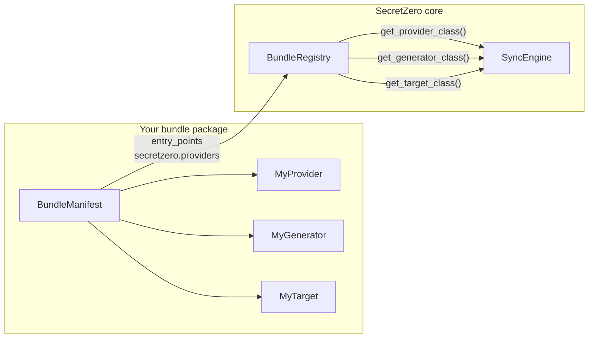

# Extending SecretZero with Provider Bundles

SecretZero's **provider bundle** system is the primary extension mechanism. A bundle is a self-contained, pip-installable Python package that contributes any combination of providers, generators, and targets to SecretZero — no core changes required.

!!! tip "Looking for API-level reference?"
    This guide is a practical walkthrough. For class-by-class API docs, see the [Bundle Reference](reference/bundles.md).

## Why Bundles?

| Concern | Before bundles | With bundles |
|---------|---------------|-------------|
| Adding a provider | Fork, edit enum, if/elif chain | `pip install secretzero-mycloud` |
| Shipping custom generators | Patch `GENERATORS` dict | Declare in `BundleManifest` |
| Maintaining out-of-tree | Merge conflicts on every release | Depends only on public API |
| Discovery | Manual import wiring | Automatic via `entry_points` |

## Architecture Overview



At startup the `BundleRegistry`:

1. Registers built-in generators, targets, and providers.
2. Loads built-in bundle manifests (AWS, Azure, Vault, GitHub, etc.).
3. Calls `discover_and_register()` which scans the `secretzero.providers` entry-point group for third-party bundles.

Your bundle package only needs to export a `BundleManifest` at the entry-point — everything else is automatic.

## Quick Start

### 1. Scaffold a new bundle

```bash
secretzero scaffold-bundle mycloud \
  --with-target mycloud_secret \
  --with-generator mycloud_token \
  --description "MyCloud provider for SecretZero"
```

This creates a complete, `pip install -e .` ready package:

```
secretzero_mycloud/
├── pyproject.toml              # with entry_points pre-configured
├── src/
│   └── secretzero_mycloud/
│       ├── __init__.py         # BUNDLE_MANIFEST declared here
│       ├── provider.py         # MyCloudProvider + MycloudAuth
│       ├── generators.py       # MycloudTokenGenerator
│       └── targets.py          # MycloudSecretTarget
├── tests/
│   └── test_provider.py
└── README.md
```

### 2. Install in development mode

```bash
cd secretzero_mycloud
pip install -e .
```

### 3. Verify registration

```bash
secretzero validate-bundle src/secretzero_mycloud
secretzero providers list   # mycloud should appear
```

### 4. Use in a Secretfile

```yaml
version: "1.0"
providers:
  mycloud:
    kind: mycloud
    auth:
      kind: token
      config:
        token: ${MYCLOUD_TOKEN}

secrets:
  api_key:
    description: "MyCloud API key"
    generator: mycloud_token
    generator_config:
      length: 48
    targets:
      - provider: mycloud
        kind: mycloud_secret
        config:
          path: /secrets/api_key
```

---

## Bundle Manifest

The `BundleManifest` is the single source of truth that tells SecretZero what your package provides:

```python
from secretzero.bundles.registry import BundleManifest

BUNDLE_MANIFEST = BundleManifest(
    name="mycloud",                                       # unique bundle ID
    version="1.0.0",                                      # semver
    provider_class="secretzero_mycloud.provider:MyCloudProvider",
    generators={
        "mycloud_token": "secretzero_mycloud.generators:MyCloudTokenGenerator",
    },
    targets={
        "mycloud_secret": "secretzero_mycloud.targets:MyCloudSecretTarget",
    },
    generator_kinds=["mycloud_token"],                    # informational
    target_kinds=["mycloud_secret"],                      # informational
)
```

### Manifest fields

| Field | Type | Required | Description |
|-------|------|----------|-------------|
| `name` | `str` | Yes | Unique identifier (lowercase, underscores). Used as the provider kind in Secretfiles. |
| `version` | `str` | No | Semver string. Defaults to `"1.0.0"`. |
| `provider_class` | `str \| None` | No | Dotted import path to a `BaseProvider` subclass (`module:Class`). |
| `generators` | `dict[str, str]` | No | Map of generator kind → dotted path to `BaseGenerator` subclass. |
| `targets` | `dict[str, str]` | No | Map of target kind → dotted path to `BaseTarget` subclass. |
| `generator_kinds` | `list[str]` | No | New generator kind strings this bundle declares (informational). |
| `target_kinds` | `list[str]` | No | New target kind strings this bundle declares (informational). |

A bundle can provide **any combination** — a provider-only bundle, a generator-only bundle, or a full-stack bundle with all three.

---

## Implementing a Provider

Providers handle authentication and connectivity to external services. See [Provider Bundle Cookbook](user-guide/bundles/cookbook.md) for advanced patterns.

```python
"""MyCloud provider implementation."""

from typing import Any

from secretzero.providers.base import BaseProvider, ProviderAuth


class MyCloudAuth(ProviderAuth):
    """Authentication handler for MyCloud."""

    ENV_TOKEN: str = "MYCLOUD_TOKEN"

    def __init__(self, config: dict[str, Any] | None = None) -> None:
        super().__init__(config)
        self._token: str | None = None

    def authenticate(self) -> bool:
        """Authenticate using token from config or environment."""
        import os

        self._token = self.config.get("token") or os.environ.get(self.ENV_TOKEN)
        return self._token is not None

    def is_authenticated(self) -> bool:
        """Check if currently authenticated."""
        return self._token is not None

    def get_client(self) -> Any:
        """Return an authenticated SDK client."""
        if not self.is_authenticated():
            self.authenticate()
        # Return your SDK client instance here
        return {"token": self._token}


class MyCloudProvider(BaseProvider):
    """MyCloud provider for SecretZero."""

    display_name = "MyCloud"
    description = "MyCloud secret management service"
    required_package: tuple[str, str] | None = ("mycloud_sdk", "mycloud-sdk")

    auth_class = MyCloudAuth

    auth_methods: dict[str, str] = {
        "token": "Use a MyCloud API token (MYCLOUD_TOKEN env var)",
    }
    config_options: dict[str, str] = {
        "region": "MyCloud region (default: us-east-1)",
        "endpoint": "Custom API endpoint URL (optional)",
    }
    config_example: str = (
        "providers:\n"
        "  mycloud:\n"
        "    kind: mycloud\n"
        "    auth:\n"
        "      kind: token\n"
        "      config:\n"
        "        token: ${MYCLOUD_TOKEN}"
    )
    target_details: dict[str, dict[str, Any]] = {
        "mycloud_secret": {
            "description": "Store secrets in MyCloud Secret Vault",
            "config": {
                "path": "Secret path in the vault",
                "region": "Override region for this target (optional)",
            },
            "example": (
                "targets:\n"
                "  - provider: mycloud\n"
                "    kind: mycloud_secret\n"
                "    config:\n"
                "      path: /secrets/my-app"
            ),
        },
    }

    def __init__(
        self,
        name: str = "mycloud",
        config: dict[str, Any] | None = None,
        auth: ProviderAuth | None = None,
    ) -> None:
        super().__init__(name=name, config=config or {}, auth=auth)

    @property
    def provider_kind(self) -> str:
        return "mycloud"

    def test_connection(self) -> tuple[bool, str | None]:
        """Test connectivity to MyCloud."""
        if self.auth and self.auth.is_authenticated():
            return True, None
        return False, "Not authenticated — set MYCLOUD_TOKEN"

    def get_supported_targets(self) -> list[str]:
        return ["mycloud_secret"]
```

### Provider class attributes

These class-level attributes power the CLI introspection commands (`secretzero providers list`, `secretzero providers --provider mycloud`):

| Attribute | Purpose |
|-----------|---------|
| `display_name` | Human-readable name shown in provider listings |
| `description` | One-line description |
| `required_package` | `(import_name, pip_name)` tuple — SecretZero checks availability |
| `auth_class` | `ProviderAuth` subclass used for authentication |
| `auth_methods` | Dict of auth method names → descriptions |
| `config_options` | Dict of config key → description |
| `config_example` | YAML snippet for documentation |
| `target_details` | Per-target documentation dict |

---

## Implementing a Generator

Generators create secret values. They must subclass `BaseGenerator` and implement `generate()`.

```python
"""MyCloud token generator."""

import secrets
from typing import Any

from secretzero.generators.base import BaseGenerator


class MyCloudTokenGenerator(BaseGenerator):
    """Generate tokens suitable for MyCloud."""

    def __init__(self, config: dict[str, Any]) -> None:
        super().__init__(config)
        self.length: int = config.get("length", 48)
        self.prefix: str = config.get("prefix", "mc_")

    def generate(self) -> str:
        """Generate a prefixed random token."""
        raw = secrets.token_urlsafe(self.length)
        return f"{self.prefix}{raw[:self.length]}"
```

Use it in a Secretfile:

```yaml
secrets:
  mycloud_key:
    generator: mycloud_token
    generator_config:
      length: 64
      prefix: "mc_live_"
```

---

## Implementing a Target

Targets store generated secret values in external systems. They must subclass `BaseTarget` and implement `store()` and `retrieve()`.

```python
"""MyCloud secret storage target."""

from typing import Any

from secretzero.targets.base import BaseTarget


class MyCloudSecretTarget(BaseTarget):
    """Store secrets in MyCloud Secret Vault."""

    def __init__(
        self,
        provider: Any | None = None,
        config: dict[str, Any] | None = None,
    ) -> None:
        super().__init__(provider=provider, config=config)
        self.path: str = self.config.get("path", "/secrets")

    def store(self, secret_name: str, secret_value: str) -> bool:
        """Store a secret in MyCloud."""
        client = self.provider.auth.get_client() if self.provider else None
        if client is None:
            return False
        # Call your SDK to store the secret
        # client.put_secret(path=f"{self.path}/{secret_name}", value=secret_value)
        return True

    def retrieve(self, secret_name: str) -> str | None:
        """Retrieve a secret from MyCloud."""
        client = self.provider.auth.get_client() if self.provider else None
        if client is None:
            return None
        # Call your SDK to retrieve the secret
        # return client.get_secret(path=f"{self.path}/{secret_name}")
        return None

    def validate(self) -> tuple[bool, str | None]:
        """Check that the target path is accessible."""
        if not self.config.get("path"):
            return False, "Target 'path' is required"
        return True, None
```

---

## Entry Points Registration

The critical wiring that makes your bundle discoverable is the `entry_points` section in `pyproject.toml`:

```toml
[project.entry-points."secretzero.providers"]
mycloud = "secretzero_mycloud:BUNDLE_MANIFEST"
```

This tells Python's packaging system: *"when someone asks for entry points in the `secretzero.providers` group, load `BUNDLE_MANIFEST` from `secretzero_mycloud`."*

SecretZero's `BundleRegistry.discover_and_register()` iterates over all such entry points at startup.

!!! tip "Multiple bundles in one package"
    You can register multiple bundles from a single package by adding multiple entry points:
    ```toml
    [project.entry-points."secretzero.providers"]
    mycloud = "mypackage.mycloud:BUNDLE_MANIFEST"
    myother = "mypackage.myother:BUNDLE_MANIFEST"
    ```

---

## Validation & Testing

### Validate your bundle

```bash
# Validate manifest, class paths, and base-class inheritance
secretzero validate-bundle src/secretzero_mycloud

# JSON output for CI pipelines
secretzero validate-bundle src/secretzero_mycloud --output-format json
```

The validator checks:

- `BUNDLE_MANIFEST` is a valid `BundleManifest` instance
- All dotted class paths can be imported
- Provider class inherits from `BaseProvider`
- Generator classes inherit from `BaseGenerator`
- Target classes inherit from `BaseTarget`

### Write tests

Good bundle tests cover:

```python
"""Tests for the MyCloud provider bundle."""

import pytest
from secretzero.bundles.registry import BundleManifest, BundleRegistry


class TestManifest:
    """Validate that the bundle manifest is well-formed."""

    def test_manifest_is_valid(self) -> None:
        from secretzero_mycloud import BUNDLE_MANIFEST

        assert isinstance(BUNDLE_MANIFEST, BundleManifest)
        assert BUNDLE_MANIFEST.name == "mycloud"

    def test_manifest_classes_importable(self) -> None:
        from secretzero_mycloud import BUNDLE_MANIFEST

        registry = BundleRegistry()
        errors = registry.validate_bundle_manifest(BUNDLE_MANIFEST)
        assert errors == [], f"Manifest validation errors: {errors}"


class TestProvider:
    """Test provider authentication and connectivity."""

    def test_provider_kind(self) -> None:
        from secretzero_mycloud.provider import MyCloudProvider

        provider = MyCloudProvider()
        assert provider.provider_kind == "mycloud"

    def test_auth_with_token(self) -> None:
        from secretzero_mycloud.provider import MyCloudAuth

        auth = MyCloudAuth(config={"token": "test-token"})
        assert auth.authenticate() is True
        assert auth.is_authenticated() is True

    def test_auth_without_token(self) -> None:
        from secretzero_mycloud.provider import MyCloudAuth

        auth = MyCloudAuth(config={})
        assert auth.is_authenticated() is False

    def test_connection_unauthenticated(self) -> None:
        from secretzero_mycloud.provider import MyCloudProvider

        provider = MyCloudProvider(config={})
        ok, msg = provider.test_connection()
        assert ok is False


class TestGenerator:
    """Test generator output."""

    def test_generates_prefixed_token(self) -> None:
        from secretzero_mycloud.generators import MyCloudTokenGenerator

        gen = MyCloudTokenGenerator(config={"length": 32, "prefix": "mc_"})
        value = gen.generate()
        assert value.startswith("mc_")
        assert len(value) > 32


class TestTarget:
    """Test target store/retrieve."""

    def test_validate_requires_path(self) -> None:
        from secretzero_mycloud.targets import MyCloudSecretTarget

        target = MyCloudSecretTarget(config={})
        ok, msg = target.validate()
        assert ok is False

    def test_validate_with_path(self) -> None:
        from secretzero_mycloud.targets import MyCloudSecretTarget

        target = MyCloudSecretTarget(config={"path": "/secrets/app"})
        ok, msg = target.validate()
        assert ok is True
```

### Run the full SecretZero test suite

After installing your bundle, run the core tests to ensure no regressions:

```bash
pip install -e .
cd /path/to/SecretZero
task test
```

---

## Bundle Lifecycle

### Versioning

Use semantic versioning for your bundle. The `version` field in `BundleManifest` is informational — use `pyproject.toml` for the actual package version.

### Graceful degradation

If your bundle's optional dependency is missing, SecretZero skips it silently. Users see the bundle only when dependencies are satisfied:

```python
# pyproject.toml
[project]
dependencies = [
    "secretzero>=0.2",
    "mycloud-sdk>=1.0",  # SDK required for this bundle
]
```

### Distribution

```bash
# Build
python -m build

# Publish to PyPI
twine upload dist/*

# Users install with:
pip install secretzero-mycloud
```

---

## CLI Tools for Bundle Authors

| Command | Description |
|---------|-------------|
| `secretzero scaffold-bundle NAME` | Generate a complete bundle package skeleton |
| `secretzero validate-bundle PATH` | Validate manifest structure and class imports |
| `secretzero providers list` | List all registered providers (including bundles) |
| `secretzero providers --provider KIND` | Show detailed info for a specific provider |
| `secretzero secret-types` | List all registered generator kinds |

---

## Built-in Bundles as Reference

All nine built-in providers are implemented as bundles internally. They serve as production-quality reference implementations:

| Bundle | Module | Generators | Targets |
|--------|--------|-----------|---------|
| `aws` | `secretzero.providers.aws` | — | `ssm_parameter`, `secrets_manager` |
| `azure` | `secretzero.providers.azure` | — | `key_vault` |
| `vault` | `secretzero.providers.vault` | — | `vault_kv` |
| `github` | `secretzero.providers.github` | `github_pat` | `github_secret` |
| `gitlab` | `secretzero.providers.gitlab` | — | `gitlab_variable`, `gitlab_group_variable` |
| `jenkins` | `secretzero.providers.jenkins` | — | `jenkins_credential` |
| `kubernetes` | `secretzero.providers.kubernetes` | — | `kubernetes_secret`, `external_secret` |
| `ansible_vault` | `secretzero.providers.ansible_vault` | — | `ansible_vault` |
| `infisical` | `secretzero.providers.infisical` | — | `infisical_secret` |

Each follows the same `_get_bundle_manifest()` pattern. Study them in `src/secretzero/providers/` for real-world patterns around error handling, multi-target support, and capability introspection.

---

## Best Practices

1. **Namespace your kinds** — prefix with your provider name: `mycloud_secret`, not `secret`
2. **Never log secrets** — use `safe_repr()` patterns for any displayed values
3. **Validate early** — implement `BaseTarget.validate()` to catch config errors before sync
4. **Type everything** — full type hints on all public APIs
5. **Document config** — populate `config_options`, `config_example`, and `target_details` on your provider class
6. **Test the manifest** — always assert `validate_bundle_manifest()` returns no errors
7. **Pin your SecretZero dependency** — `secretzero>=0.2,<1.0` for forward compatibility
8. **Ship a README** — the scaffold command creates one; keep it updated
