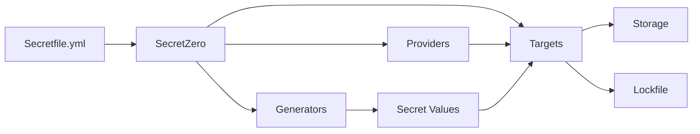
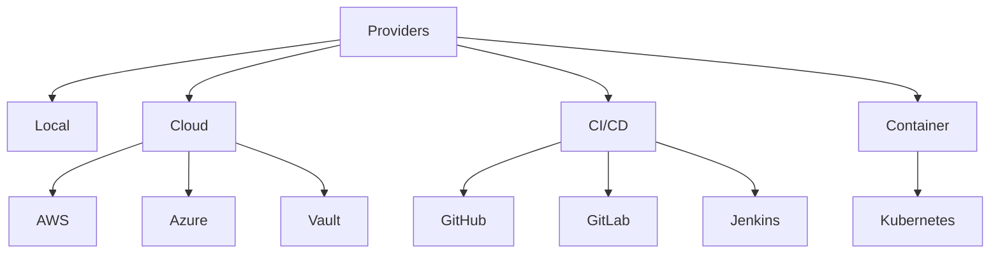
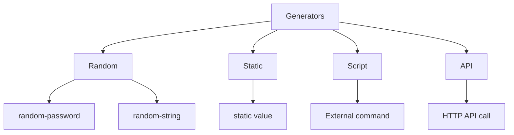
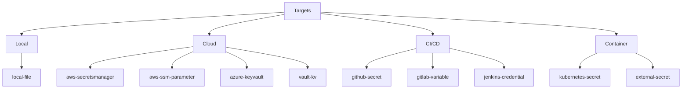
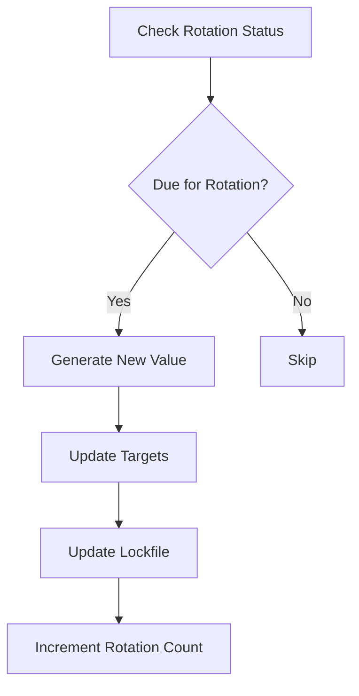
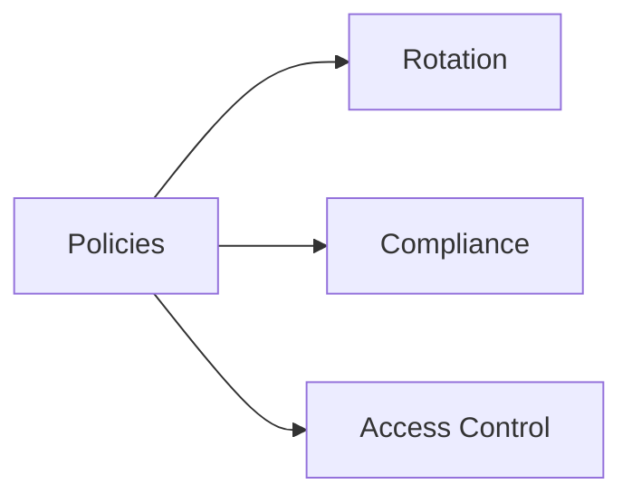
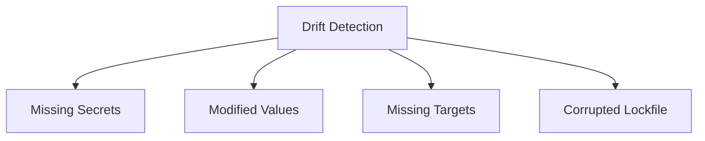
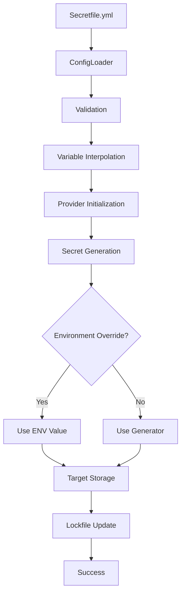
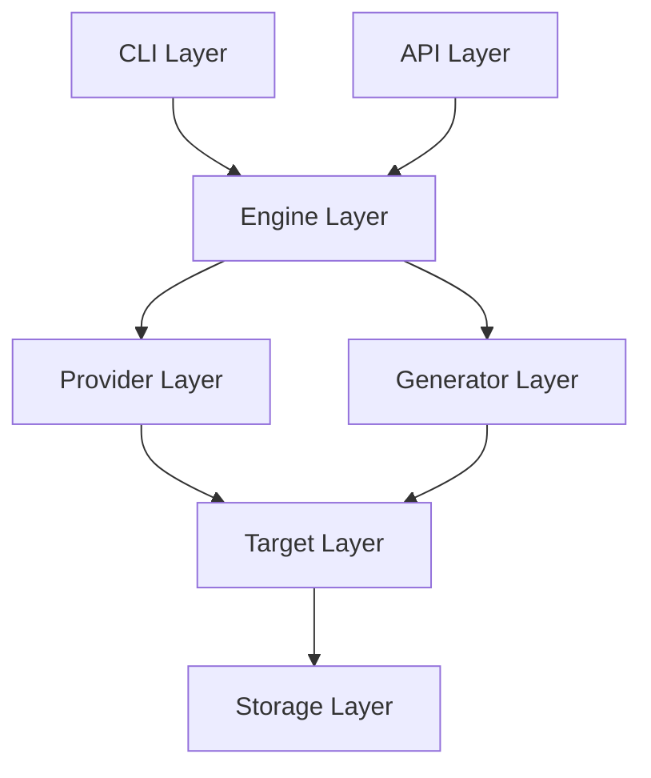
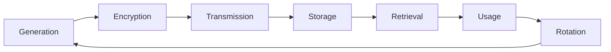

# Core Concepts

This guide explains the fundamental concepts and architecture of SecretZero. Understanding these concepts will help you design effective secret management strategies.

## Overview

SecretZero follows a declarative, infrastructure-as-code approach to secret management. You define what secrets you need, how they should be generated, and where they should be stored—SecretZero handles the rest.



## Secretfile Structure

The `Secretfile.yml` is the single source of truth for all your secrets. It's a YAML configuration file that describes:

- **What** secrets you need
- **How** they should be generated
- **Where** they should be stored
- **When** they should be rotated

### Basic Structure

```yaml
version: "1.0"

metadata:
  name: my-project
  description: Project secrets
  owner: platform-team

variables:
  environment: development
  region: us-east-1

providers:
  aws:
    kind: aws
    auth:
      kind: ambient

secrets:
  api_key:
    template:
      type: api_key
      fields:
        - name: value
          generator:
            type: random-string
            length: 32
    targets:
      - type: local-file
        path: .env
        format: dotenv

policies:
  rotation_required:
    type: rotation
    config:
      require_rotation_period: true
```

### Component Breakdown

#### Version

```yaml
version: "1.0"
```

Specifies the Secretfile schema version. Used for backward compatibility.

#### Metadata

```yaml
metadata:
  name: my-project
  description: Project description
  owner: team-name
  environments:
    - development
    - staging
    - production
  compliance:
    - soc2
    - iso27001
```

Project metadata for documentation and compliance tracking:

- **name**: Project identifier
- **description**: Human-readable description
- **owner**: Team or person responsible
- **environments**: Deployment targets
- **compliance**: Standards to enforce (SOC2, ISO27001)

#### Variables

```yaml
variables:
  environment: development
  aws_region: us-east-1
  db_host: localhost
```

Reusable values for interpolation throughout the configuration:

- Can be overridden by environment variables
- Support default values with Jinja2 syntax
- Enable environment-specific configurations

**Interpolation:**

```yaml
targets:
  - type: aws-secretsmanager
    name: "/{{var.environment}}/db/password"
    region: "{{var.aws_region}}"
```

## Providers

Providers manage authentication and connectivity to secret storage backends.

### Provider Types



### Provider Configuration

```yaml
providers:
  # AWS provider
  aws:
    kind: aws
    auth:
      kind: ambient  # or token, assume_role
      config:
        region: us-east-1
        role_arn: arn:aws:iam::123456789012:role/SecretAdmin  # for assume_role
  
  # Azure provider
  azure:
    kind: azure
    auth:
      kind: default  # or managed_identity, cli
      config:
        subscription_id: your-subscription-id
  
  # HashiCorp Vault
  vault:
    kind: vault
    auth:
      kind: token  # or approle
      config:
        url: https://vault.example.com
        token: ${VAULT_TOKEN}
  
  # GitHub Actions
  github:
    kind: github
    auth:
      kind: token
      config:
        token: ${GITHUB_TOKEN}
  
  # Kubernetes
  kubernetes:
    kind: kubernetes
    auth:
      kind: ambient
      config:
        kubeconfig: ~/.kube/config
        context: production
```

### Authentication Methods

Different providers support different auth methods:

| Provider | Auth Methods |
|----------|-------------|
| AWS | `ambient`, `profile`, `assume_role` |
| Azure | `default`, `managed_identity`, `cli` |
| Vault | `token`, `approle` |
| GitHub | `token` |
| GitLab | `token` |
| Jenkins | `token` |
| Kubernetes | `ambient`, `in_cluster`, `token` |

## Secrets

Secrets are the core data structures that SecretZero manages.

### Secret Definition

```yaml
secrets:
  database_password:
    # Optional: Secret template type
    template:
      type: password
      fields:
        - name: value
          generator:
            type: random-password
            length: 32
    
    # Optional: One-time generation
    one_time: false
    
    # Optional: Rotation policy
    rotation:
      period: 90d
    
    # Required: Where to store the secret
    targets:
      - type: local-file
        path: .env
        format: dotenv
```

### Secret Types

Secrets can be simple (single value) or complex (multiple fields):

#### Simple Secret

```yaml
api_key:
  template:
    type: api_key
    fields:
      - name: value
        generator:
          type: random-string
          length: 32
```

#### Complex Secret (Template)

```yaml
database_credentials:
  template:
    type: database
    fields:
      - name: username
        generator:
          type: static
          value: myapp_user
      - name: password
        generator:
          type: random-password
          length: 32
      - name: host
        generator:
          type: static
          value: db.example.com
      - name: port
        generator:
          type: static
          value: "5432"
```

## Generators

Generators create secret values using various algorithms and sources.

### Generator Types



### Random Password

Generates cryptographically secure passwords:

```yaml
generator:
  type: random-password
  length: 32
  include_upper: true
  include_lower: true
  include_numbers: true
  include_symbols: true
  exclude_characters: '"@/\`'
```

**Features:**

- Uses Python's `secrets` module (cryptographically secure)
- Customizable character sets
- Character exclusion for compatibility
- Minimum length enforcement

### Random String

Generates random alphanumeric strings:

```yaml
generator:
  type: random-string
  length: 40
  charset: hex  # alphanumeric, alpha, numeric, hex
```

**Use cases:**

- API tokens
- Session IDs
- Webhook secrets

### Static

Provides static values with optional validation:

```yaml
generator:
  type: static
  value: my-value
  validation: ^[a-zA-Z0-9\-\.]+$  # Optional regex
```

**Use cases:**

- Usernames
- API endpoints
- Configuration values

### Script

Executes external commands:

```yaml
generator:
  type: script
  command: ssh-keygen
  args:
    - -t
    - rsa
    - -b
    - "4096"
    - -f
    - /dev/stdout
    - -N
    - ""
  timeout: 30
```

**Use cases:**

- SSH key generation
- Certificate creation
- Custom secret generation logic

## Targets

Targets define where secrets are stored.

### Target Types



### Local File Target

Store secrets in local files:

```yaml
targets:
  - type: local-file
    path: .env
    format: dotenv  # dotenv, json, yaml, toml, tfvars
    merge: true
    key: API_KEY  # Optional: custom key name
```

**Formats:**

**Dotenv (.env):**
```bash
API_KEY=value123
DATABASE_PASSWORD=secure456
```

**JSON:**
```json
{
  "api_key": "value123",
  "database_password": "secure456"
}
```

**YAML:**
```yaml
api_key: value123
database_password: secure456
```

### Cloud Targets

#### AWS Secrets Manager

```yaml
targets:
  - type: aws-secretsmanager
    provider: aws
    name: /myapp/database/password
    description: Database password
    kms_key_id: alias/myapp  # Optional
```

#### AWS SSM Parameter Store

```yaml
targets:
  - type: aws-ssm-parameter
    provider: aws
    name: /myapp/api_key
    type: SecureString  # String, SecureString, StringList
    tier: Standard  # Standard, Advanced
    overwrite: true
```

#### Azure Key Vault

```yaml
targets:
  - type: azure-keyvault
    provider: azure
    vault_url: https://myvault.vault.azure.net
    secret_name: database-password
```

#### HashiCorp Vault

```yaml
targets:
  - type: vault-kv
    provider: vault
    path: myapp/database/password
    mount_point: secret
    version: 2  # KV version
```

### CI/CD Targets

#### GitHub Actions

```yaml
targets:
  - type: github-secret
    provider: github
    owner: myorg
    repo: myrepo
    environment: production  # Optional
```

#### GitLab CI/CD

```yaml
targets:
  - type: gitlab-variable
    provider: gitlab
    project: mygroup/myproject
    environment_scope: production
    protected: true
    masked: true
```

#### Jenkins

```yaml
targets:
  - type: jenkins-credential
    provider: jenkins
    credential_id: api-key-prod
    credential_type: string  # string, username_password
    description: Production API Key
```

### Kubernetes Targets

```yaml
targets:
  - type: kubernetes-secret
    provider: kubernetes
    namespace: production
    secret_name: app-secrets
    secret_type: Opaque  # Opaque, kubernetes.io/tls, etc.
    data_key: password
```

## Templates

Templates define reusable secret structures with multiple fields.

### Template Definition

```yaml
templates:
  database_config:
    description: Complete database configuration
    fields:
      username:
        description: Database username
        generator:
          type: static
          value: app_user
      password:
        description: Database password
        generator:
          type: random-password
          length: 32
      host:
        generator:
          type: static
          value: "{{var.db_host}}"
      port:
        generator:
          type: static
          value: "5432"
    targets:
      - type: local-file
        path: config/database.json
        format: json
```

### Using Templates

```yaml
secrets:
  production_database:
    kind: templates.database_config
    variables:
      db_host: prod-db.example.com
  
  staging_database:
    kind: templates.database_config
    variables:
      db_host: staging-db.example.com
```

## Lockfile

The lockfile (`.gitsecrets.lock`) tracks the state of all secrets.

### Purpose

- **Change Detection**: Determine if secrets have changed
- **Rotation Tracking**: Record when secrets were last rotated
- **One-Time Secrets**: Prevent regeneration of one-time secrets
- **Audit Trail**: Historical record of secret operations

### Structure

```json
{
  "version": "1.0",
  "secrets": {
    "api_key": {
      "hash": "sha256:a1b2c3d4e5f6g7h8...",
      "created_at": "2026-02-16T12:00:00.000000+00:00",
      "updated_at": "2026-02-16T12:00:00.000000+00:00",
      "last_rotated": "2026-02-16T12:00:00.000000+00:00",
      "rotation_count": 0,
      "targets": {
        ".env": {
          "hash": "sha256:...",
          "updated_at": "2026-02-16T12:00:00.000000+00:00"
        }
      }
    }
  },
  "metadata": {
    "last_sync": "2026-02-16T12:00:00.000000+00:00"
  }
}
```

### Security

The lockfile stores **one-way SHA-256 hashes**, not actual secret values:

- Safe to commit to version control
- Enables change detection without exposing secrets
- Supports compliance audits

!!! info "Lockfile Safety"
    The lockfile contains only hashes and timestamps. It's safe to commit to Git for tracking purposes.

## Rotation

Secret rotation is the process of generating new values for existing secrets.

### Rotation Policies

```yaml
secrets:
  api_key:
    rotation:
      period: 90d  # Rotate every 90 days
```

**Supported Periods:**

- `7d` - Weekly
- `30d` - Monthly
- `90d` - Quarterly (SOC2 compliant)
- `180d` - Semi-annually
- `365d` or `1y` - Annually

### Rotation Workflow



### Commands

```bash
# Check rotation status
secretzero rotate --dry-run

# Rotate due secrets
secretzero rotate

# Force rotate specific secret
secretzero rotate --force api_key
```

### One-Time Secrets

Secrets with `one_time: true` are never automatically rotated:

```yaml
secrets:
  master_key:
    one_time: true
    rotation:
      period: 90d  # Warns but doesn't rotate
```

## Policies

Policies enforce security and compliance requirements.

### Policy Types



### Rotation Policy

Enforce rotation requirements:

```yaml
policies:
  require_rotation:
    type: rotation
    config:
      require_rotation_period: true
      max_age: 90d
      severity: error
```

### Compliance Policy

Built-in compliance frameworks:

```yaml
policies:
  soc2_compliance:
    type: compliance
    config:
      standard: soc2  # soc2, iso27001
      severity: error
```

**Requirements:**

- **SOC2**: All secrets must have rotation periods ≤ 90 days
- **ISO27001**: All secrets must have documented rotation periods

### Access Control Policy

Restrict allowed/denied targets:

```yaml
policies:
  cloud_only:
    type: access
    config:
      allowed_targets:
        - aws-secretsmanager
        - aws-ssm-parameter
      denied_targets:
        - local-file
      severity: warning
```

## Drift Detection

Drift detection identifies when secrets have been modified outside SecretZero.

### Drift Types



### Detection Process

1. Compare lockfile hashes with current values
2. Check if target files exist
3. Verify secret configuration matches
4. Report discrepancies

### Commands

```bash
# Check for drift
secretzero drift

# Check specific secret
secretzero drift api_key
```

### Remediation

```bash
# Resync all secrets
secretzero sync --force

# Resync specific secret
secretzero sync --force api_key
```

## Architecture

### Data Flow



### Component Layers



**Layers:**

1. **CLI/API Layer**: User interface (commands, endpoints)
2. **Engine Layer**: Business logic (sync, rotation, policy)
3. **Provider Layer**: Authentication and connectivity
4. **Generator Layer**: Secret value generation
5. **Target Layer**: Secret storage abstraction
6. **Storage Layer**: Actual storage backends

## Security Model

### Principles

1. **Defense in Depth**: Multiple layers of security
2. **Least Privilege**: Minimal required permissions
3. **Encryption at Rest**: Cloud providers handle encryption
4. **Encryption in Transit**: HTTPS for all API calls
5. **No Secret Storage**: Lockfile contains only hashes
6. **Audit Trail**: All operations logged

### Secret Lifecycle



### Access Control

**Provider Authentication:**

- AWS: IAM roles/policies
- Azure: Managed Identity/RBAC
- Vault: Token/AppRole
- Kubernetes: ServiceAccount/RBAC

**API Authentication:**

- API key authentication
- Timing-safe comparison
- Audit logging

## Extensibility Points

SecretZero is designed to be extensible:

### Custom Generators

```python
from secretzero.generators.base import BaseGenerator

class CustomGenerator(BaseGenerator):
    def generate(self, config: dict) -> str:
        # Your custom logic
        return "generated-value"
```

### Custom Targets

```python
from secretzero.targets.base import BaseTarget

class CustomTarget(BaseTarget):
    def store(self, secret_name: str, value: str) -> None:
        # Your custom storage logic
        pass
```

### Custom Providers

```python
from secretzero.providers.base import BaseProvider

class CustomProvider(BaseProvider):
    def test_connection(self) -> bool:
        # Your custom connectivity test
        return True
```

See the [Extending SecretZero](../extending.md) guide for details.

## Best Practices

### 1. Use Variables for Flexibility

```yaml
variables:
  environment: "{{env.ENVIRONMENT or 'development'}}"
  region: "{{env.AWS_REGION or 'us-east-1'}}"
```

### 2. Separate Lockfiles per Environment

```bash
secretzero sync --lockfile .gitsecrets-prod.lock
secretzero sync --lockfile .gitsecrets-staging.lock
```

### 3. Multiple Targets for Redundancy

```yaml
targets:
  - type: aws-secretsmanager
  - type: local-file  # Backup
```

### 4. Use Templates for Reusability

Define common patterns once, use many times.

### 5. Enable Policies Early

Catch issues before they reach production:

```yaml
policies:
  require_rotation:
    type: rotation
    severity: error
```

### 6. Always Dry-Run First

```bash
secretzero sync --dry-run
secretzero rotate --dry-run
```

## Next Steps

Now that you understand the core concepts:

1. **[Build Your First Project →](first-project.md)** - Hands-on tutorial
2. **[Explore Examples →](../examples/index.md)** - Real-world configurations
3. **[User Guide →](../user-guide/index.md)** - Detailed documentation
4. **[Architecture Deep Dive →](../reference/architecture.md)** - Technical details

## Additional Resources

- [Secretfile Schema Reference](../schema.md)
- [CLI Commands](../reference/cli.md)
- [API Documentation](../user-guide/api/index.md)
- [FAQ](../reference/faq.md)
