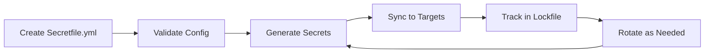

# Getting Started with SecretZero

Welcome to SecretZero! This guide will help you get up and running with secret management in minutes.

## What You'll Learn

In this section, you'll learn how to:

1. **Install SecretZero** and its optional dependencies
2. **Set up your first project** with a Secretfile
3. **Generate and sync secrets** to various targets
4. **Understand core concepts** like providers, targets, and generators

## Prerequisites

Before you begin, ensure you have:

- **Python 3.9 or higher** installed
- **pip** package manager
- Basic familiarity with YAML configuration files
- (Optional) Access to cloud providers (AWS, Azure, etc.) if using cloud targets

## Quick Navigation

<div class="grid cards" markdown>

-   :material-download: **Installation**

    ---

    Install SecretZero and optional dependencies for your use case
    
    [Install Now →](installation.md)

-   :material-flash: **Quick Start**

    ---

    Create your first project and generate secrets in 5 minutes
    
    [Quick Start →](quickstart.md)

-   :material-file-document: **First Project**

    ---

    Step-by-step guide to creating a complete SecretZero project
    
    [Build Your Project →](first-project.md)

-   :material-brain: **Basic Concepts**

    ---

    Understand the key concepts and architecture of SecretZero
    
    [Learn Concepts →](concepts.md)

</div>

## What is SecretZero?

SecretZero is a **secrets orchestration engine** that helps you:

- **Generate** secrets using various generators (passwords, API keys, certificates)
- **Store** secrets in multiple locations (local files, cloud providers, CI/CD platforms)
- **Rotate** secrets automatically based on policies
- **Track** secret lifecycle with lockfiles
- **Validate** compliance with security policies

Think of it as **infrastructure-as-code for secrets** - all your secret requirements are declared in a single `Secretfile.yml`, making secret management reproducible and auditable.

## The SecretZero Workflow



1. **Define** secrets in `Secretfile.yml`
2. **Validate** configuration
3. **Generate** secret values
4. **Sync** to target locations
5. **Track** in lockfile
6. **Rotate** based on policies

## Key Benefits

### For Developers

- **No more manual secret generation** - Automated secret creation
- **Consistent across environments** - Same process for dev, staging, prod
- **Local development support** - Easy .env file management
- **Self-documenting** - All secrets defined in code

### For DevOps Engineers

- **Multi-cloud support** - AWS, Azure, Vault, Kubernetes
- **CI/CD integration** - GitHub Actions, GitLab CI, Jenkins
- **Automated rotation** - Policy-based lifecycle management
- **Audit trail** - Complete history in lockfiles and audit logs

### For Security Teams

- **Policy enforcement** - SOC2, ISO27001 compliance
- **Drift detection** - Alert on unauthorized changes
- **Access control** - Fine-grained policies
- **Zero-trust bootstrap** - Secure initial secret generation

## Example Use Case

Here's a real-world example of what SecretZero can do:

**Problem**: You need to deploy a new production environment with:
- Database credentials
- API keys for external services
- TLS certificates
- Kubernetes secrets
- GitHub Actions secrets

**Without SecretZero**: 
- Manually generate each secret
- Store them in various locations
- Document where each secret is stored
- Set up rotation reminders
- Track when secrets were created

**With SecretZero**:
```bash
# Define everything in Secretfile.yml once
secretzero validate

# Generate and sync all secrets
secretzero sync

# All secrets are now in the right places with full tracking
```

✅ Database password → AWS Secrets Manager + .env  
✅ API keys → GitHub Actions secrets  
✅ TLS cert → Kubernetes secret  
✅ Everything tracked in `.gitsecrets.lock`  
✅ Rotation policies automatically enforced

## Next Steps

Ready to get started? Follow these steps in order:

1. **[Install SecretZero](installation.md)** - Set up the tool and dependencies
2. **[Quick Start](quickstart.md)** - Create your first secret in 5 minutes
3. **[First Project](first-project.md)** - Build a complete project with multiple secrets
4. **[Learn Concepts](concepts.md)** - Understand the architecture and patterns

Or jump directly to a specific topic:

- [User Guide](../user-guide/index.md) - Detailed documentation for all features
- [Use Cases](../use-cases/index.md) - Real-world examples and patterns
- [API Reference](../user-guide/api/index.md) - REST API documentation
- [Examples](../examples/index.md) - Complete example projects

## Getting Help

If you run into issues:

- Check the [FAQ](../reference/faq.md) for common questions
- Review the [Troubleshooting Guide](../reference/troubleshooting.md)
- Search [existing issues](https://github.com/zloeber/SecretZero/issues)
- Ask in [GitHub Discussions](https://github.com/zloeber/SecretZero/discussions)
- Open a [new issue](https://github.com/zloeber/SecretZero/issues/new)

Let's get started! 🚀
