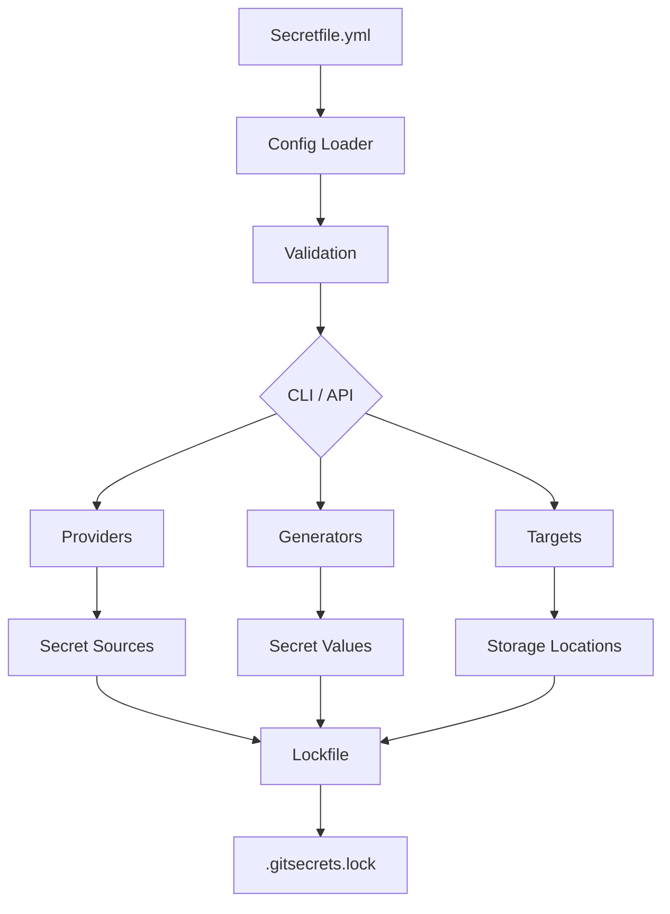

# Welcome to SecretZero™

<div align="center">
<a href="https://secret0.com/">

</a>
</div>

<p align="center">
    <a href="https://github.com/zloeber/SecretZero/releases/latest">
        
    </a>
    <a href="https://github.com/zloeber/SecretZero/blob/main/LICENSE">
        
    </a>
    <a href="https://deepwiki.com/zloeber/SecretZero">
        
    </a>
    
    
    
    
</p>

## The Problem

If you have ever asked any of these questions about a new or existing git project then SecretZero is for you!

- Where are all the secrets in my project?
- How do I generate new secrets, api keys, or certificates to deploy a whole new environment?
- How do I handle secret-zero?
- When were my critical project secrets last rotated?
- If I needed to bootstrap this entire project from scratch would I be able to do so without manually handling any secrets?
- How do I document my project's secrets surface area and requirements?

## Secrets Orchestration, Lifecycle, and Bootstrap Engine

SecretZero is a secrets management tool that automates the creation, seeding, and lifecycle management of project secrets through a declarative, schema-driven workflow. Think of it as:

- **Terraform for secrets lifecycle** - Declarative configuration for all your secrets
- **Renovate for credentials** - Automated rotation and lifecycle management
- **npm/yarn for secret dependencies** - Dependency graph and lockfile tracking
- **A compliance tool** - Built-in policies for SOC2, ISO27001, and custom requirements

!!! info "🔒 Local-First Discovery"
    The `discover` command uses **local AI models (Ollama)** by default. **No sensitive project data is sent to external services.** All secret analysis happens on your machine. Optional remote LLM providers (OpenAI, Anthropic) require explicit configuration.

!!! warning "Active Development"
    SecretZero is actively being developed. Features and APIs may change between releases. Please refer to the [CHANGELOG](./reference/changelog.md) for breaking changes and version your dependencies accordingly.

## Why SecretZero?

### The Problem

If you've ever asked any of these questions about a codebase, SecretZero is for you:

- **Where are all the secrets in my project?**
- **How do I generate new secrets to deploy a whole new environment?**
- **How do I handle secret-zero bootstrap?**
- **When were my critical project secrets last rotated?**
- **Can I bootstrap this entire project from scratch without manually handling secrets?**
- **How do I document my project's secrets surface area and requirements?**

### The Solution

SecretZero provides a **single source of truth** for all secrets in your project through a declarative `Secretfile.yml`:

```yaml
version: "1.0"
metadata:
  name: my-project
  description: Production secrets configuration

secrets:
  database_password:
    template:
      type: password
      fields:
        - name: value
          generator:
            type: random-password
            length: 32
    targets:
      - type: aws-secretsmanager
        name: /prod/db/password
      - type: local-file
        path: .env
        format: dotenv
```

## Key Features

### 🚀 Core Capabilities

- **Idempotent Bootstrap** - Generate initial secrets for one or more environments
- **Lockfile Tracking** - SHA-256 hashing with rotation history and timestamps
- **Dual-Purpose Providers** - Request/rotate secrets and store them across platforms
- **Type Safety** - Strongly-typed Pydantic models at every layer
- **Multiple Profiles** - Target multiple environments independently
- **Environment Fallbacks** - Manual secret override via environment variables
- **Self-Documenting** - Secrets-as-code showing provenance and distribution

### 🤖 AI-Powered Secret Discovery

- **Automated Discovery** - Find existing secrets, credentials, and sensitive configuration
- **Local-First Analysis** - All analysis runs locally using Ollama (no data leaves your machine)
- **AI-Assisted** - Uses language models to intelligently identify secret patterns
- **Confidence Scoring** - Distinguishes high-confidence from low-confidence discoveries
- **Secretfile Generation** - Auto-generates `Secretfile.detect.yml` with recommendations
- **Privacy-Focused** - Optional remote LLM support with explicit configuration required

### 🔄 Secret Rotation

- **Secret Rotation** - Policy-based rotation (90d, 2w, custom periods)
- **Rotation Tracking** - History, count, and timestamps in lockfile
- **One-Time Secrets** - Support for secrets that should never rotate
- **Compliance Policies** - Built-in SOC2 and ISO27001 support

### 🌐 API Service

- **REST API** - FastAPI-based HTTP API for programmatic management
- **OpenAPI Docs** - Interactive Swagger UI and ReDoc
- **Secure Authentication** - API key-based with timing-safe comparison
- **Audit Logging** - Comprehensive audit trail for all operations
- **Remote Management** - Manage secrets from CI/CD, scripts, or applications

### ☁️ Platform Support

=== "Cloud Providers"
    - **AWS** - Secrets Manager, SSM Parameter Store, IAM roles
    - **Azure** - Key Vault, Managed Identity
    - **HashiCorp Vault** - KV v2, Token/AppRole auth

=== "CI/CD Platforms"
    - **GitHub** - Actions secrets (repo, environment, org)
    - **GitLab** - CI/CD variables (project, group)
    - **Jenkins** - Credentials (string, username/password)

=== "Container Platforms"
    - **Kubernetes** - Secrets (all types), External Secrets Operator
    - Native support for TLS, Docker registry, SSH keys

=== "Local Storage"
    - **Files** - .env, JSON, YAML, TOML formats
    - Merge/append support for existing files

## Quick Start

### Discover Existing Secrets

```bash
# Discover secrets using local AI analysis (Ollama required)
secretzero discover

# Reviews discovered secrets in Secretfile.detect.yml
# All analysis is local - no data leaves your machine
```

### Installation

```bash
# Basic installation
uv tool install secretzero

# With cloud providers
uv tool install secretzero[aws,azure,vault]

# With CI/CD support
uv tool install secretzero[cicd]

# With API server
uv tool install secretzero[api]

# Everything
uv tool install secretzero[all]
```

### Initialize a Project

```bash
# Create a new Secretfile (or use discovered Secretfile.detect.yml)
secretzero create

# Validate configuration
secretzero validate

# Test provider connectivity
secretzero test
```

### Generate and Sync Secrets

```bash
# Preview what would be generated
secretzero sync --dry-run

# Generate and sync secrets to all targets
secretzero sync

# Show status of a specific secret
secretzero show database_password
```

### Manage Secret Lifecycle

```bash
# Check which secrets need rotation
secretzero rotate --dry-run

# Rotate secrets based on policies
secretzero rotate

# Check policy compliance
secretzero policy

# Detect drift from expected state
secretzero drift
```

### Start the API Server

```bash
# Start the REST API server
export SECRETZERO_API_KEY=$(python -c "import secrets; print(secrets.token_urlsafe(32))")
secretzero-api

# Access interactive docs at http://localhost:8000/docs
```

## Use Cases

<div class="grid cards" markdown>

-   :material-laptop: **Local Development**

    ---

    Generate development secrets locally with .env file support
    
    [Learn more →](use-cases/local-development.md)

-   :material-github: **GitHub Actions**

    ---

    Automated secret management for GitHub Actions workflows
    
    [Learn more →](use-cases/github-actions.md)

-   :material-kubernetes: **Kubernetes**

    ---

    Native Kubernetes secret management and External Secrets Operator
    
    [Learn more →](use-cases/kubernetes.md)

-   :material-cloud: **Multi-Cloud**

    ---

    Synchronize secrets across AWS, Azure, and HashiCorp Vault
    
    [Learn more →](use-cases/multi-cloud.md)

-   :material-shield-check: **Compliance**

    ---

    SOC2 and ISO27001 compliance with policy enforcement
    
    [Learn more →](use-cases/compliance.md)

-   :material-swap-horizontal: **Augmenting**

    ---

    Augment your existing secret management tools
    
    [Learn more →](use-cases/augmenting.md)

</div>

## Workflow Visuals

See graph and sync workflow screenshots in the docs:

- [Workflow visuals →](getting-started/workflows.md)


## Architecture

SecretZero follows a clean, modular architecture:



## What's Next?

<div class="grid cards" markdown>

-   :material-rocket-launch: **Get Started**

    ---

    Follow our step-by-step guide to set up your first project
    
    [Getting Started →](getting-started/index.md)

-   :material-book-open-variant: **User Guide**

    ---

    Learn about configuration, providers, targets, and CLI commands
    
    [User Guide →](user-guide/index.md)

-   :material-school: **Examples**

    ---

    Explore complete examples for different use cases
    
    [View Examples →](examples/index.md)

-   :material-api: **API Reference**

    ---

    Integrate SecretZero into your applications and workflows
    
    [API Docs →](user-guide/api/index.md)

</div>

## Community

- **GitHub**: [zloeber/SecretZero](https://github.com/zloeber/SecretZero)
- **Issues**: [Report bugs or request features](https://github.com/zloeber/SecretZero/issues)
- **Discussions**: [Ask questions and share ideas](https://github.com/zloeber/SecretZero/discussions)

## License

SecretZero is licensed under the [Apache License 2.0](https://github.com/zloeber/SecretZero/blob/main/LICENSE).
