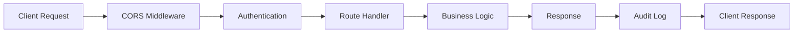

# API Python Reference

This page provides auto-generated documentation for the SecretZero API module, including all FastAPI endpoints, schemas, and utilities.

## Overview

The SecretZero API is built with FastAPI and provides a REST interface for all SecretZero operations. This reference documents the Python implementation details.

!!! info "Interactive API Documentation"
    For interactive API testing and OpenAPI specifications, see the [Interactive API Reference](api-interactive.md).

## API Application

::: secretzero.api.app
    options:
      show_source: true
      heading_level: 3
      members:
        - create_app

## Request/Response Schemas

### Pydantic Models

All API requests and responses use Pydantic models for validation and serialization.

::: secretzero.api.schemas
    options:
      show_source: true
      heading_level: 3
      members:
        - HealthResponse
        - ErrorResponse
        - ConfigValidationRequest
        - ConfigValidationResponse
        - ConfigRenderResponse
        - SecretListResponse
        - SecretDetailResponse
        - SecretStatusResponse
        - SyncRequest
        - SyncResponse
        - RotationCheckRequest
        - RotationCheckResponse
        - RotationExecuteRequest
        - RotationExecuteResponse
        - DriftCheckRequest
        - DriftCheckResponse
        - PolicyCheckRequest
        - PolicyCheckResponse
        - ProviderListResponse
        - TargetListResponse
        - SecretTypesResponse
        - VariableListResponse
        - GraphResponse
        - AuditLogResponse

## Authentication

API key authentication middleware.

::: secretzero.api.auth
    options:
      show_source: true
      heading_level: 3

## Audit Logging

Audit trail functionality for API operations.

::: secretzero.api.audit
    options:
      show_source: true
      heading_level: 3

## Server

CLI entry point for running the API server.

::: secretzero.api.server
    options:
      show_source: true
      heading_level: 3

## Usage Examples

### Creating a Custom App

```python
from secretzero.api import create_app

# Create app with custom config path
app = create_app(secretfile_path="path/to/Secretfile.yml")

# Run with uvicorn
import uvicorn
uvicorn.run(app, host="0.0.0.0", port=8000)
```

### Custom Middleware

```python
from fastapi import FastAPI, Request
from secretzero.api import create_app

app = create_app()

@app.middleware("http")
async def custom_middleware(request: Request, call_next):
    # Add custom logic
    response = await call_next(request)
    return response
```

### Custom Routes

```python
from secretzero.api import create_app

app = create_app()

@app.get("/custom")
async def custom_endpoint():
    return {"message": "Custom endpoint"}
```

### Testing

```python
from fastapi.testclient import TestClient
from secretzero.api import create_app

app = create_app()
client = TestClient(app)

def test_health():
    response = client.get("/health")
    assert response.status_code == 200
    assert response.json()["status"] == "healthy"
```

## Environment Variables

| Variable | Description | Default |
|----------|-------------|---------|
| `SECRETZERO_HOST` | Host to bind to | `0.0.0.0` |
| `SECRETZERO_PORT` | Port to listen on | `8000` |
| `SECRETZERO_CONFIG` | Path to Secretfile | `Secretfile.yml` |
| `SECRETZERO_API_KEY` | API key for authentication | None (auth disabled) |
| `SECRETZERO_RELOAD` | Enable auto-reload | `false` |
| `SECRETZERO_LOG_LEVEL` | Logging level | `info` |

## Development

### Running Locally

```bash
# Install with API extras
pip install -e ".[api,dev]"

# Set up environment
export SECRETZERO_API_KEY=$(python -c "import secrets; print(secrets.token_urlsafe(32))")
export SECRETZERO_CONFIG=Secretfile.yml

# Run with auto-reload
export SECRETZERO_RELOAD=true
secretzero-api
```

### Testing the API

```bash
# Run API tests
pytest tests/test_api.py -v

# Run with coverage
pytest tests/test_api.py --cov=secretzero.api --cov-report=term-missing
```

### Type Checking

```bash
# Check API types
mypy src/secretzero/api/
```

## Architecture

### Request Flow



### Components

- **FastAPI App**: Main application instance
- **Middleware**: CORS, authentication, error handling
- **Routes**: Endpoint definitions with validation
- **Schemas**: Pydantic models for request/response
- **Business Logic**: Core SecretZero operations
- **Audit Logger**: Track all API operations

## Security

### Authentication

The API uses API key authentication:

```python
from secretzero.api.auth import RequireAuth

@app.get("/protected")
async def protected_endpoint(_auth: str = RequireAuth):
    return {"message": "Authenticated"}
```

### CORS

Configure CORS for production:

```python
app.add_middleware(
    CORSMiddleware,
    allow_origins=["https://yourdomain.com"],
    allow_credentials=True,
    allow_methods=["GET", "POST"],
    allow_headers=["X-API-Key"],
)
```

### Rate Limiting

Implement rate limiting with middleware:

```python
from slowapi import Limiter, _rate_limit_exceeded_handler
from slowapi.util import get_remote_address

limiter = Limiter(key_func=get_remote_address)
app.state.limiter = limiter
app.add_exception_handler(RateLimitExceeded, _rate_limit_exceeded_handler)

@app.get("/endpoint")
@limiter.limit("5/minute")
async def limited_endpoint(request: Request):
    return {"message": "Rate limited"}
```

## Performance

### Caching

```python
from functools import lru_cache

@lru_cache(maxsize=128)
def get_cached_config():
    return load_config()
```

### Async Operations

All endpoints are async-capable:

```python
@app.get("/async-operation")
async def async_endpoint():
    result = await async_operation()
    return result
```

### Connection Pooling

Use connection pooling for external services:

```python
import httpx

async_client = httpx.AsyncClient()

@app.on_event("shutdown")
async def shutdown():
    await async_client.aclose()
```

## Deployment

### Docker

```dockerfile
FROM python:3.12-slim

WORKDIR /app
COPY . .
RUN pip install secretzero[api]

EXPOSE 8000
CMD ["secretzero-api"]
```

### Docker Compose

```yaml
version: '3.8'
services:
  api:
    build: .
    ports:
      - "8000:8000"
    environment:
      - SECRETZERO_API_KEY=${API_KEY}
      - SECRETZERO_CONFIG=/app/Secretfile.yml
    volumes:
      - ./Secretfile.yml:/app/Secretfile.yml:ro
```

### Kubernetes

```yaml
apiVersion: apps/v1
kind: Deployment
metadata:
  name: secretzero-api
spec:
  replicas: 3
  selector:
    matchLabels:
      app: secretzero-api
  template:
    metadata:
      labels:
        app: secretzero-api
    spec:
      containers:
      - name: api
        image: secretzero:latest
        ports:
        - containerPort: 8000
        env:
        - name: SECRETZERO_API_KEY
          valueFrom:
            secretKeyRef:
              name: secretzero-api
              key: api-key
```

### Reverse Proxy (nginx)

```nginx
server {
    listen 80;
    server_name api.example.com;

    location / {
        proxy_pass http://localhost:8000;
        proxy_set_header Host $host;
        proxy_set_header X-Real-IP $remote_addr;
        proxy_set_header X-Forwarded-For $proxy_add_x_forwarded_for;
    }
}
```

## Next Steps

- [Interactive API Reference](api-interactive.md) - Test endpoints interactively
- [API Getting Started](../api-getting-started.md) - Quick start guide
- [Examples](../examples/complete.md) - Real-world usage examples
- [Configuration](../user-guide/configuration/index.md) - Configure SecretZero
