# Architecture

This document provides a deep dive into SecretZero's architecture, design decisions, and extensibility points.

## Overview

SecretZero follows a layered, modular architecture designed for extensibility, testability, and maintainability.

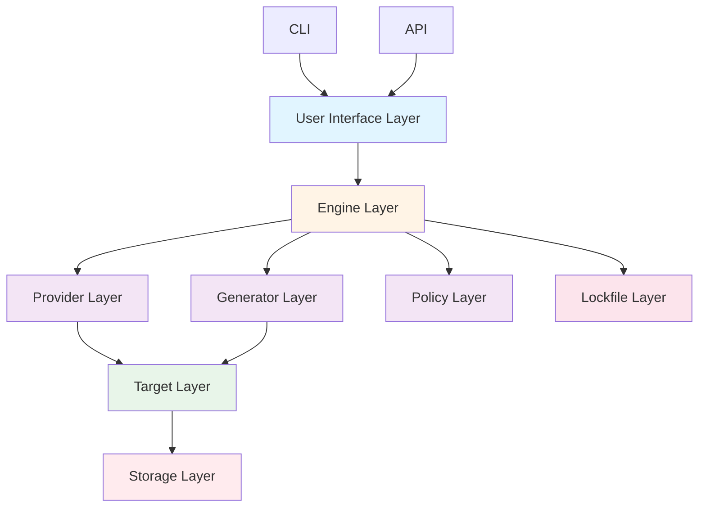

## Component Overview

### 1. User Interface Layer

Provides interfaces for interacting with SecretZero.

#### CLI (Command Line Interface)

**Location**: `src/secretzero/cli.py`

**Responsibilities**:
- Parse command-line arguments
- Validate user input
- Display formatted output
- Handle user interactions

**Key Commands**:

```python
@click.group()
def cli():
    """SecretZero CLI"""
    pass

@cli.command()
def init():
    """Initialize new Secretfile"""
    pass

@cli.command()
def sync():
    """Sync secrets to targets"""
    pass

@cli.command()
def rotate():
    """Rotate secrets"""
    pass
```

**Technologies**:
- **Click**: Command-line framework
- **Rich**: Terminal formatting and tables
- **Pydantic**: Input validation

#### API (REST Interface)

**Location**: `src/secretzero/api/`

**Responsibilities**:
- Expose HTTP endpoints
- Handle authentication
- Audit logging
- OpenAPI documentation

**Key Endpoints**:

```python
@app.get("/secrets")
async def list_secrets():
    """List all secrets"""
    pass

@app.post("/sync")
async def sync_secrets():
    """Sync secrets to targets"""
    pass

@app.post("/rotation/execute")
async def rotate_secrets():
    """Execute rotation"""
    pass
```

**Technologies**:
- **FastAPI**: Async web framework
- **Uvicorn**: ASGI server
- **Pydantic**: Request/response models

### 2. Engine Layer

Core business logic for secret management operations.

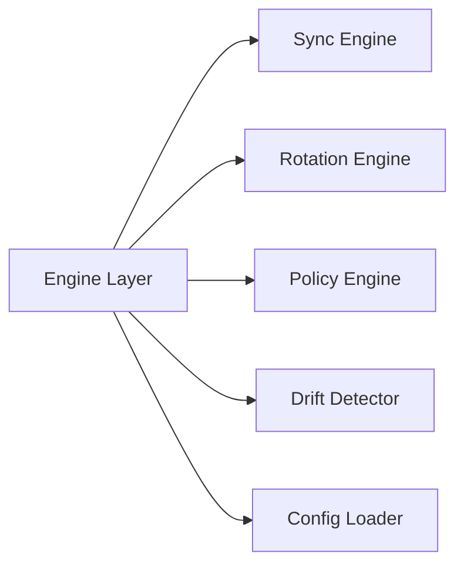

#### Sync Engine

**Location**: `src/secretzero/sync.py`

**Responsibilities**:
- Orchestrate secret generation
- Manage provider initialization
- Store secrets in targets
- Update lockfile

**Algorithm**:

```
FOR EACH secret IN secretfile:
    IF secret.one_time AND exists_in_lockfile(secret):
        SKIP
    ELSE:
        value = generate_secret(secret)
        FOR EACH target IN secret.targets:
            store_secret(target, value)
        update_lockfile(secret, value)
```

**Key Methods**:

```python
class SyncEngine:
    def sync(self, secretfile: Secretfile, lockfile: Lockfile) -> SyncResult:
        """Sync all secrets"""
        pass
    
    def _generate_secret(self, secret: Secret) -> str:
        """Generate secret value"""
        pass
    
    def _store_in_target(self, target: Target, value: str) -> None:
        """Store secret in target"""
        pass
```

#### Rotation Engine

**Location**: `src/secretzero/rotation.py`

**Responsibilities**:
- Calculate rotation due dates
- Determine which secrets need rotation
- Execute rotation operations
- Update rotation metadata

**Algorithm**:

```
FOR EACH secret IN secretfile:
    IF NOT secret.rotation_period:
        SKIP
    IF secret.one_time:
        WARN (one_time secrets don't rotate)
    ELSE:
        due_date = last_rotated + rotation_period
        IF current_date >= due_date OR force:
            rotate_secret(secret)
            update_rotation_metadata(secret)
```

**Key Methods**:

```python
class RotationEngine:
    def check_rotation_status(self, secretfile: Secretfile, lockfile: Lockfile) -> List[RotationStatus]:
        """Check which secrets need rotation"""
        pass
    
    def execute_rotation(self, secrets: List[str]) -> RotationResult:
        """Rotate specified secrets"""
        pass
    
    def _calculate_due_date(self, secret: Secret, lockfile: Lockfile) -> datetime:
        """Calculate when rotation is due"""
        pass
```

#### Policy Engine

**Location**: `src/secretzero/policy.py`

**Responsibilities**:
- Validate secrets against policies
- Enforce compliance requirements
- Generate violation reports
- Provide remediation suggestions

**Policy Types**:

```python
class RotationPolicy:
    """Enforce rotation requirements"""
    require_rotation_period: bool
    max_age: timedelta
    severity: Severity

class CompliancePolicy:
    """Enforce compliance standards"""
    standard: str  # soc2, iso27001
    severity: Severity

class AccessPolicy:
    """Control target access"""
    allowed_targets: List[str]
    denied_targets: List[str]
    severity: Severity
```

#### Drift Detector

**Location**: `src/secretzero/drift.py`

**Responsibilities**:
- Compare lockfile with actual state
- Detect unauthorized changes
- Identify missing secrets
- Report drift status

**Detection Algorithm**:

```
FOR EACH secret IN lockfile:
    FOR EACH target IN secret.targets:
        actual_value = read_target(target)
        expected_hash = lockfile.hash(secret)
        IF hash(actual_value) != expected_hash:
            REPORT drift(secret, target)
```

#### Config Loader

**Location**: `src/secretzero/config.py`

**Responsibilities**:
- Parse YAML configuration
- Interpolate variables
- Validate schema
- Handle errors gracefully

**Key Methods**:

```python
class ConfigLoader:
    def load_file(self, path: Path) -> Secretfile:
        """Load and parse Secretfile"""
        pass
    
    def validate_file(self, path: Path) -> Tuple[bool, str]:
        """Validate configuration"""
        pass
    
    def _interpolate_variables(self, config: dict, variables: dict) -> dict:
        """Replace {{var.name}} with values"""
        pass
```

### 3. Provider Layer

Manages authentication and connectivity to secret storage backends.

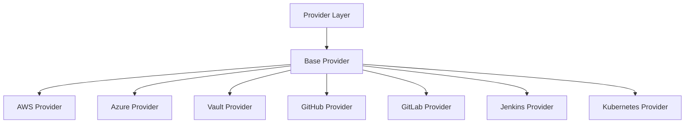

#### Base Provider

**Location**: `src/secretzero/providers/base.py`

**Interface**:

```python
class BaseProvider(ABC):
    @abstractmethod
    def authenticate(self) -> None:
        """Authenticate with provider"""
        pass
    
    @abstractmethod
    def test_connection(self) -> bool:
        """Test connectivity"""
        pass
    
    @abstractmethod
    def get_supported_targets(self) -> List[str]:
        """List supported target types"""
        pass
```

#### Provider Registry

**Location**: `src/secretzero/providers/registry.py`

**Responsibilities**:
- Register provider classes
- Create provider instances
- Manage provider lifecycle
- Handle missing dependencies gracefully

**Pattern**: Singleton Registry

```python
class ProviderRegistry:
    _instance = None
    _providers = {}
    
    @classmethod
    def instance(cls) -> 'ProviderRegistry':
        """Get singleton instance"""
        pass
    
    def register(self, kind: str, provider_class: Type[BaseProvider]) -> None:
        """Register provider"""
        pass
    
    def create(self, kind: str, config: dict) -> BaseProvider:
        """Create provider instance"""
        pass
```

### 4. Generator Layer

Produces secret values using various algorithms and sources.

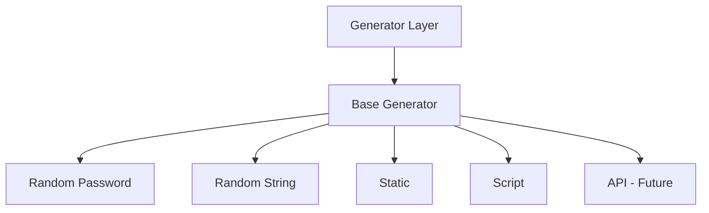

#### Base Generator

**Location**: `src/secretzero/generators/base.py`

**Interface**:

```python
class BaseGenerator(ABC):
    @abstractmethod
    def generate(self, config: dict) -> str:
        """Generate secret value"""
        pass
    
    def check_environment_override(self, secret_name: str, field_name: str) -> Optional[str]:
        """Check for environment variable override"""
        env_var = f"{secret_name}_{field_name}".upper()
        return os.environ.get(env_var)
```

#### Generator Implementations

**Random Password** (`src/secretzero/generators/random_password.py`):

```python
class RandomPasswordGenerator(BaseGenerator):
    def generate(self, config: dict) -> str:
        length = config.get('length', 32)
        charset = self._build_charset(config)
        return ''.join(secrets.choice(charset) for _ in range(length))
```

**Random String** (`src/secretzero/generators/random_string.py`):

```python
class RandomStringGenerator(BaseGenerator):
    def generate(self, config: dict) -> str:
        length = config.get('length', 32)
        charset_name = config.get('charset', 'alphanumeric')
        charset = self._get_charset(charset_name)
        return ''.join(secrets.choice(charset) for _ in range(length))
```

**Static** (`src/secretzero/generators/static.py`):

```python
class StaticGenerator(BaseGenerator):
    def generate(self, config: dict) -> str:
        value = config.get('value', config.get('default', ''))
        validation = config.get('validation')
        if validation and not re.match(validation, value):
            raise ValueError(f"Value doesn't match pattern: {validation}")
        return value
```

**Script** (`src/secretzero/generators/script.py`):

```python
class ScriptGenerator(BaseGenerator):
    def generate(self, config: dict) -> str:
        command = config['command']
        args = config.get('args', [])
        timeout = config.get('timeout', 30)
        result = subprocess.run(
            [command] + args,
            capture_output=True,
            text=True,
            timeout=timeout
        )
        return result.stdout.strip()
```

### 5. Target Layer

Abstracts secret storage across different backends.

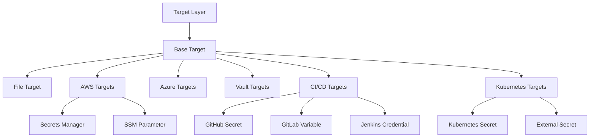

#### Base Target

**Location**: `src/secretzero/targets/base.py`

**Interface**:

```python
class BaseTarget(ABC):
    @abstractmethod
    def store(self, secret_name: str, value: str) -> None:
        """Store secret in target"""
        pass
    
    @abstractmethod
    def retrieve(self, secret_name: str) -> Optional[str]:
        """Retrieve secret from target"""
        pass
    
    def validate_config(self, config: dict) -> bool:
        """Validate target configuration"""
        pass
```

#### Target Implementations

**File Target** (`src/secretzero/targets/file.py`):

```python
class FileTarget(BaseTarget):
    def store(self, secret_name: str, value: str) -> None:
        format = self.config['format']
        if format == 'dotenv':
            self._store_dotenv(secret_name, value)
        elif format == 'json':
            self._store_json(secret_name, value)
        elif format == 'yaml':
            self._store_yaml(secret_name, value)
```

**AWS Secrets Manager** (`src/secretzero/targets/aws.py`):

```python
class SecretsManagerTarget(BaseTarget):
    def store(self, secret_name: str, value: str) -> None:
        client = self.provider.get_client('secretsmanager')
        try:
            client.create_secret(
                Name=self.config['name'],
                SecretString=value
            )
        except client.exceptions.ResourceExistsException:
            client.put_secret_value(
                SecretId=self.config['name'],
                SecretString=value
            )
```

### 6. Lockfile Layer

Tracks secret state and history.

**Location**: `src/secretzero/lockfile.py`

**Structure**:

```json
{
  "version": "1.0",
  "secrets": {
    "secret_name": {
      "hash": "sha256:...",
      "created_at": "2026-02-16T12:00:00Z",
      "updated_at": "2026-02-16T12:00:00Z",
      "last_rotated": "2026-02-16T12:00:00Z",
      "rotation_count": 0,
      "targets": {
        "target_id": {
          "hash": "sha256:...",
          "updated_at": "2026-02-16T12:00:00Z"
        }
      }
    }
  },
  "metadata": {
    "last_sync": "2026-02-16T12:00:00Z"
  }
}
```

**Key Methods**:

```python
class Lockfile:
    def add_secret(self, name: str, value: str, targets: List[str]) -> None:
        """Add or update secret"""
        pass
    
    def get_secret(self, name: str) -> Optional[SecretEntry]:
        """Get secret entry"""
        pass
    
    def has_changed(self, name: str, value: str) -> bool:
        """Check if value has changed"""
        pass
    
    def save(self, path: Path) -> None:
        """Save lockfile to disk"""
        pass
```

## Data Flow

### Secret Generation Flow

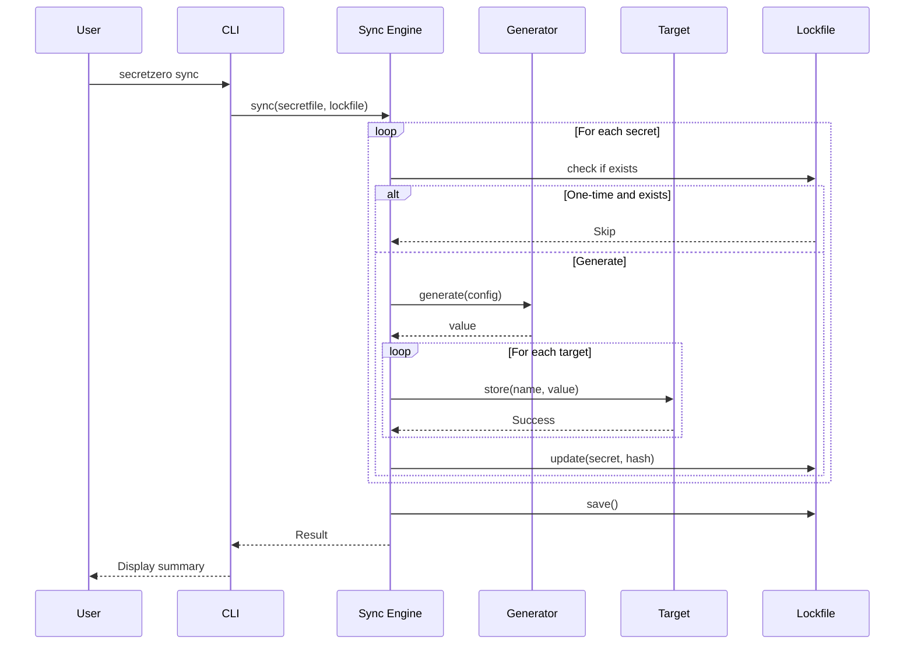

### Provider Authentication Flow

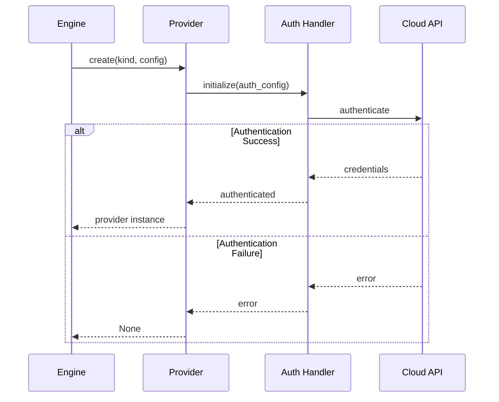

### Rotation Flow

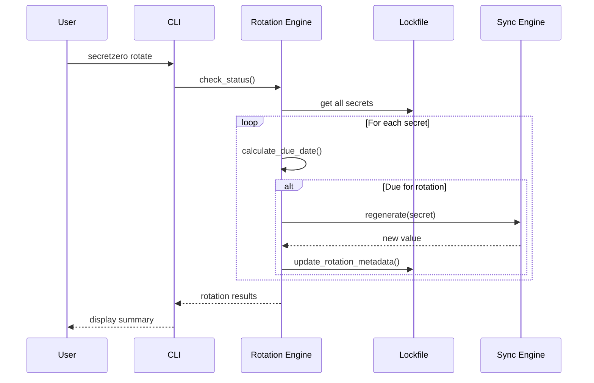

## Security Model

### Secret Handling

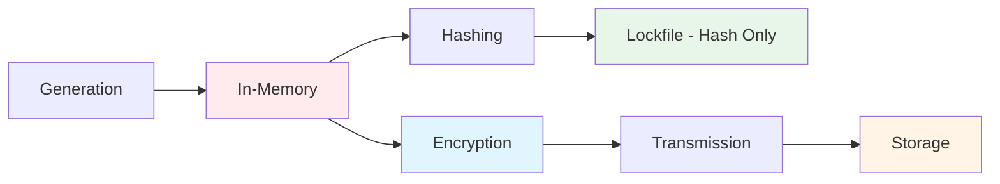

**Principles**:

1. **Minimal Exposure**: Secrets exist in memory only during operations
2. **One-Way Hashing**: Lockfile stores SHA-256 hashes, not values
3. **Encryption in Transit**: All cloud API calls over HTTPS
4. **Encryption at Rest**: Cloud providers handle storage encryption
5. **No Logging**: Secret values never logged

### Authentication Security

**AWS**:
- IAM roles (preferred)
- Temporary credentials
- Assume role support

**Azure**:
- Managed Identity (preferred)
- Azure AD authentication
- Certificate-based auth

**Kubernetes**:
- ServiceAccount tokens
- RBAC authorization
- Namespace isolation

### API Security

**Authentication**:
```python
def verify_api_key(provided_key: str, expected_key: str) -> bool:
    # Timing-safe comparison
    provided_hash = hashlib.sha256(provided_key.encode()).digest()
    expected_hash = hashlib.sha256(expected_key.encode()).digest()
    return secrets.compare_digest(provided_hash, expected_hash)
```

**Audit Logging**:
```python
def log_audit_event(action: str, resource: str, user: str, success: bool) -> None:
    entry = {
        "timestamp": datetime.utcnow().isoformat(),
        "action": action,
        "resource": resource,
        "user": user,
        "success": success
    }
    audit_log.append(entry)
```

## Extensibility

### Adding a Custom Generator

```python
# my_generator.py
from secretzero.generators.base import BaseGenerator

class CustomGenerator(BaseGenerator):
    def generate(self, config: dict) -> str:
        # Your implementation
        return generated_value

# Register
from secretzero.generators import register_generator
register_generator('custom', CustomGenerator)
```

### Adding a Custom Target

```python
# my_target.py
from secretzero.targets.base import BaseTarget

class CustomTarget(BaseTarget):
    def store(self, secret_name: str, value: str) -> None:
        # Your implementation
        pass
    
    def retrieve(self, secret_name: str) -> Optional[str]:
        # Your implementation
        pass

# Register
from secretzero.targets import register_target
register_target('custom', CustomTarget)
```

### Adding a Custom Provider

```python
# my_provider.py
from secretzero.providers.base import BaseProvider

class CustomProvider(BaseProvider):
    def authenticate(self) -> None:
        # Your authentication logic
        pass
    
    def test_connection(self) -> bool:
        # Your connectivity test
        return True
    
    def get_supported_targets(self) -> List[str]:
        return ['custom-target']

# Register
from secretzero.providers.registry import ProviderRegistry
ProviderRegistry.instance().register('custom', CustomProvider)
```

## Design Patterns

### Singleton Pattern

**Provider Registry**:
```python
class ProviderRegistry:
    _instance = None
    
    @classmethod
    def instance(cls) -> 'ProviderRegistry':
        if cls._instance is None:
            cls._instance = cls()
        return cls._instance
```

### Factory Pattern

**Target Creation**:
```python
def create_target(kind: str, config: dict) -> BaseTarget:
    target_classes = {
        'local-file': FileTarget,
        'aws-secretsmanager': SecretsManagerTarget,
        'kubernetes-secret': KubernetesSecretTarget,
    }
    target_class = target_classes.get(kind)
    if not target_class:
        raise ValueError(f"Unknown target: {kind}")
    return target_class(config)
```

### Strategy Pattern

**Generator Selection**:
```python
def select_generator(kind: str) -> BaseGenerator:
    generators = {
        'random-password': RandomPasswordGenerator,
        'random-string': RandomStringGenerator,
        'static': StaticGenerator,
        'script': ScriptGenerator,
    }
    return generators[kind]()
```

### Observer Pattern

**Audit Logging**:
```python
class AuditLogger:
    _observers = []
    
    def subscribe(self, observer: Callable) -> None:
        self._observers.append(observer)
    
    def notify(self, event: AuditEvent) -> None:
        for observer in self._observers:
            observer(event)
```

## Performance Considerations

### Optimization Strategies

1. **Lazy Provider Initialization**: Providers created only when needed
2. **Caching**: Config and lockfile cached during operations
3. **Parallel Target Updates**: Future enhancement for concurrent writes
4. **Minimal Memory Footprint**: Secrets cleared from memory ASAP

### Scalability

**Current Limits**:
- Secrets per file: ~1000 (YAML parsing limit)
- Targets per secret: ~100 (reasonable limit)
- Concurrent operations: Sequential (current)

**Future Enhancements**:
- Async target operations
- Connection pooling
- Distributed lockfile (Redis/DB)

## Testing Architecture

### Test Layers

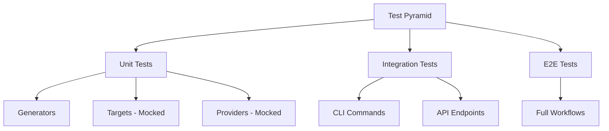

### Mocking Strategy

**Provider Mocking**:
```python
@pytest.fixture
def mock_aws_provider(mocker):
    mock = mocker.Mock(spec=AWSProvider)
    mock.test_connection.return_value = True
    return mock
```

**Target Mocking**:
```python
@pytest.fixture
def mock_file_target(tmp_path):
    target = FileTarget({
        'path': str(tmp_path / '.env'),
        'format': 'dotenv'
    })
    return target
```

## Deployment Architectures

### Local Development

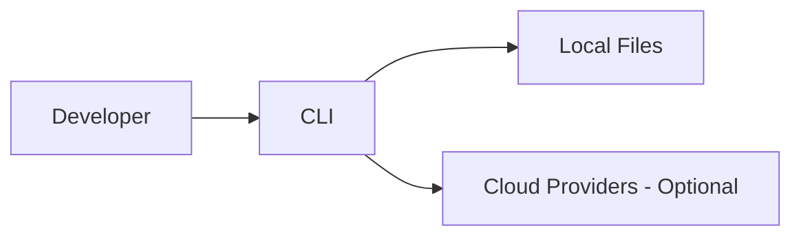

### CI/CD Pipeline

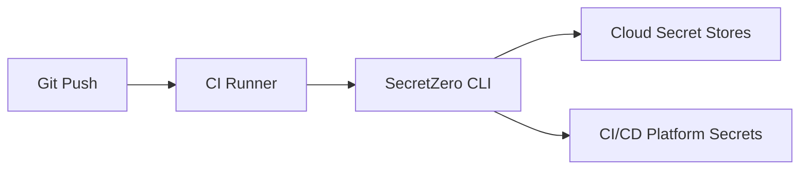

### API Service

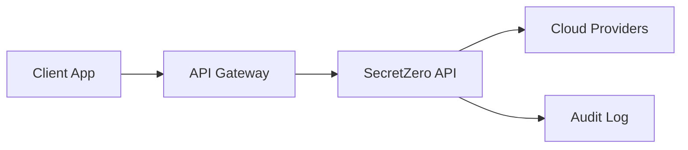

### Kubernetes Operator (Future)

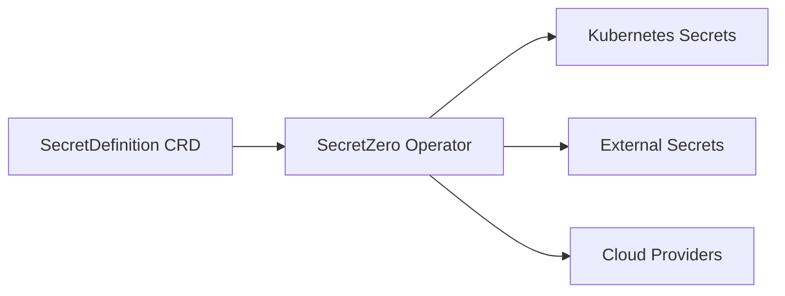

## Future Enhancements

### Planned Features

1. **Async Operations**: Non-blocking target updates
2. **Webhooks**: Notifications for rotation events
3. **Web UI**: Browser-based management
4. **Kubernetes Operator**: Native K8s integration
5. **Terraform Provider**: Infrastructure-as-code integration
6. **Database Backend**: Replace file-based lockfile
7. **Multi-Tenancy**: Support for multiple projects/teams
8. **Secret Versioning**: Historical secret values (hashed)

### Architecture Evolution

**Phase 8: Documentation & Website** (Current)
- Static documentation site
- Interactive examples
- Video tutorials

**Phase 9: Advanced Integrations** (Future)
- Terraform provider
- Kubernetes operator
- Ansible modules
- Chef/Puppet integrations

**Phase 10: Operational maturity** (Future)
- Multi-tenancy
- RBAC
- SSO integration
- High availability
- Disaster recovery

## See Also

- [Core Concepts](../getting-started/concepts.md) - High-level overview
- [Extending SecretZero](../extending.md) - Extension guide
- [API Reference](../user-guide/api/index.md) - REST API docs
- [Schema Reference](../schema.md) - Secretfile schema
