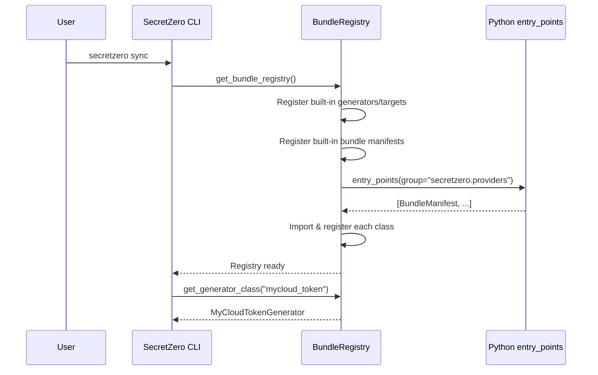

# Provider Bundles

Provider bundles are SecretZero's plugin system. They let you add new providers, generators, and targets without modifying the core codebase — just `pip install` and go.

## How It Works

A bundle is a standard Python package that exports a `BundleManifest` via a `pyproject.toml` entry point. SecretZero discovers and loads all installed bundles automatically at startup.



## Getting Started

=== "Create a bundle"

    ```bash
    secretzero scaffold-bundle mycloud --with-target mycloud_secret
    ```

=== "Install it"

    ```bash
    cd secretzero_mycloud && pip install -e .
    ```

=== "Use it"

    ```yaml
    # Secretfile.yml
    providers:
      mycloud:
        kind: mycloud
        auth:
          kind: token
          config:
            token: ${MYCLOUD_TOKEN}

    secrets:
      api_key:
        generator: random_password
        targets:
          - provider: mycloud
            kind: mycloud_secret
            config:
              path: /secrets/api_key
    ```

## What's in a Bundle?

Every bundle provides a `BundleManifest` that declares:

| Component | What it does | Required? |
|-----------|-------------|-----------|
| **Provider** | Auth + connectivity to an external service | No |
| **Generators** | Create secret values (tokens, passwords, certs) | No |
| **Targets** | Store secrets in external systems | No |
| **Terraform provider metadata** | Describes how this bundle maps to a Terraform provider for `secretzero terraform` export | No |

You can ship any combination. A generator-only bundle is perfectly valid.

When adding Terraform support for your bundle, set the optional
`terraform_provider` field on `BundleManifest`. This metadata declares the
Terraform provider name, registry source, version constraint, and any
default provider configuration that should be emitted when users run
`secretzero terraform`.

## Guides

- **[Creating a Bundle](../../extending.md)** — Full walkthrough from scaffold to publish
- **[Bundle Cookbook](cookbook.md)** — Advanced patterns: multi-target, capabilities, OAuth
- **[Bundle Reference](../../reference/bundles.md)** — API-level class documentation

## Built-in Bundles

SecretZero ships with nine built-in bundles. They're implemented using the same `BundleManifest` architecture as third-party bundles and serve as reference implementations.

| Bundle | Provider | Generators | Targets |
|--------|----------|-----------|---------|
| **[AWS](../providers/aws.md)** | `aws` | — | `ssm_parameter`, `secrets_manager` |
| **[Azure](../providers/azure.md)** | `azure` | — | `key_vault` |
| **[Vault](../providers/vault.md)** | `vault` | — | `vault_kv` |
| **[GitHub](../providers/github.md)** | `github` | `github_pat` | `github_secret` |
| **[GitLab](../providers/gitlab.md)** | `gitlab` | — | `gitlab_variable`, `gitlab_group_variable` |
| **[Jenkins](../providers/jenkins.md)** | `jenkins` | — | `jenkins_credential` |
| **[Kubernetes](../providers/kubernetes.md)** | `kubernetes` | — | `kubernetes_secret`, `external_secret` |
| **Ansible Vault** | `ansible_vault` | — | `ansible_vault` |
| **Infisical** | `infisical` | — | `infisical_secret` |

## CLI Commands

```bash
# Scaffold a new bundle package
secretzero scaffold-bundle mycloud --with-target mycloud_secret

# Validate a bundle before publishing
secretzero validate-bundle ./secretzero_mycloud

# List all registered providers (built-in + third-party)
secretzero providers list

# Inspect a specific provider's config and targets
secretzero providers --provider mycloud
```
