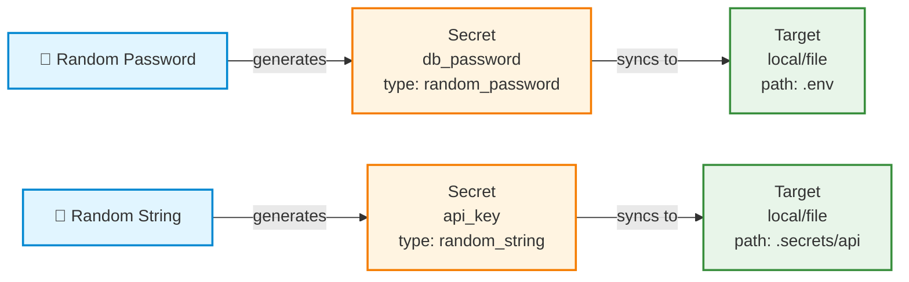
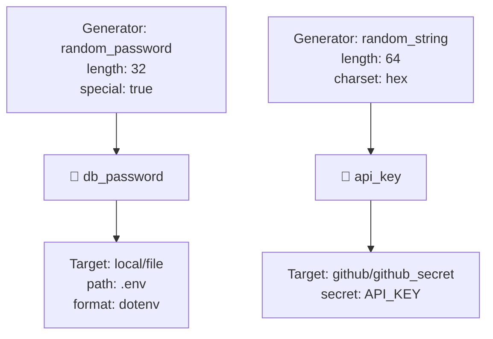
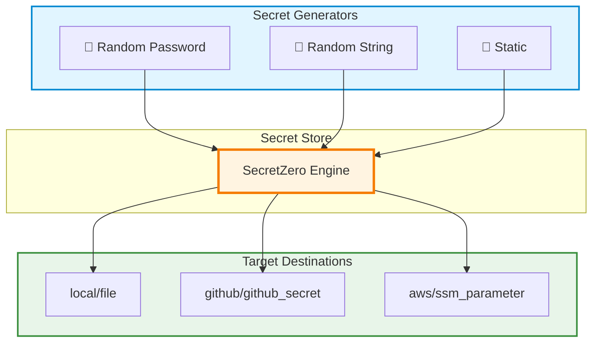
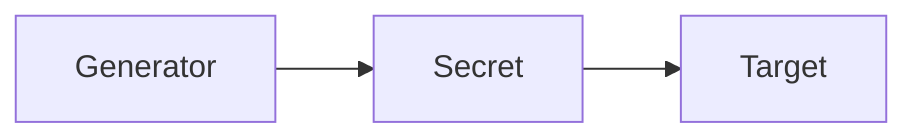

# Graph Visualization

The `secretzero graph` command generates visual representations of your Secretfile configuration, making it easy to understand secret flows at a glance.

## Quick Start

```bash
# Generate a simple flow diagram
secretzero graph

# Generate with detailed configuration
secretzero graph --type detailed

# Show high-level architecture
secretzero graph --type architecture

# Display in terminal (text format)
secretzero graph --format terminal

# Save to file
secretzero graph --output docs/secretflow.md
```

## Graph Types

### Flow Diagram (Default)

Shows the relationship between generators, secrets, and targets in a left-to-right flowchart.

```bash
secretzero graph --type flow
```

**Example Output:**



**Best For:**
- Understanding secret relationships
- Documenting project secrets
- Onboarding new team members
- README documentation

### Detailed Diagram

Includes configuration parameters and more detailed information about each component.

```bash
secretzero graph --type detailed
```

**Example Output:**



**Best For:**
- Debugging configuration issues
- Understanding generator parameters
- Reviewing target configurations
- Technical documentation

### Architecture Diagram

High-level view showing system architecture with grouped components.

```bash
secretzero graph --type architecture
```

**Example Output:**



**Best For:**
- System overview
- Architecture documentation
- Presentation slides
- High-level planning

## Output Formats

### Mermaid (Default)

Generates Mermaid diagram markdown that can be:
- Rendered in GitHub README files
- Embedded in documentation sites (MkDocs, Docusaurus, etc.)
- Viewed at [mermaid.live](https://mermaid.live)
- Rendered in GitLab, Notion, and other platforms

```bash
secretzero graph --format mermaid
```

### Terminal

Text-based summary optimized for console viewing.

```bash
secretzero graph --format terminal
```

**Example Output:**

```
SecretZero Configuration Summary
================================================================================

Metadata:
  Project: MyApp
  Owner: platform-team
  Description: Production secrets for MyApp

Providers (3):
  • local (local)
  • github (github)
  • aws (aws)

Secrets (3):

  db_password
    Generator: random_password
    Targets (2):
      → local/file
        path: .env
      → aws/secrets_manager
        secret_name: /prod/db/password

  api_key
    Generator: random_string
    Targets (2):
      → local/file
        path: .secrets/api_key
      → github/github_secret
        secret_name: API_KEY

  jwt_secret
    Generator: random_string
    Targets (1):
      → aws/ssm_parameter
        secret_name: /prod/jwt-secret

================================================================================
```

**Best For:**
- Quick configuration review
- CI/CD pipeline output
- Terminal-based documentation
- Scripting and automation

## Saving to File

Save generated diagrams to a file for documentation:

```bash
# Save flow diagram
secretzero graph --output docs/architecture/secretflow.md

# Save detailed diagram
secretzero graph --type detailed --output docs/secrets-detailed.md

# Save terminal summary
secretzero graph --format terminal --output SECRETS.txt
```

## Use Cases

### Documentation

Automatically generate up-to-date secret flow diagrams for your documentation:

```bash
# Generate diagram for README
secretzero graph --type architecture --output README-secrets.md

# Generate detailed reference
secretzero graph --type detailed --output docs/secret-reference.md
```

Then include in your README:

```markdown
## Secrets Architecture

<!-- Include generated diagram -->
[!include[Secret Flow](README-secrets.md)]
```

### CI/CD Integration

Validate and document secrets as part of your CI/CD pipeline:

```yaml
# .github/workflows/secrets-audit.yml
name: Secret Documentation

on: [push]

jobs:
  generate-docs:
    runs-on: ubuntu-latest
    steps:
      - uses: actions/checkout@v2
      - name: Install SecretZero
        run: pip install secretzero
      - name: Generate Secret Flow Diagram
        run: secretzero graph --output docs/secretflow.md
      - name: Commit updated docs
        # ... commit changes
```

### Pre-Commit Hook

Automatically update documentation before commits:

```bash
#!/bin/bash
# .git/hooks/pre-commit

# Generate updated secret flow
secretzero graph --output docs/secretflow.md

# Add to staging if changed
git add docs/secretflow.md
```

### Team Onboarding

Help new developers understand your secret architecture:

```bash
# Generate comprehensive documentation
secretzero graph --type flow --output docs/secrets-flow.md
secretzero graph --type architecture --output docs/secrets-architecture.md
secretzero graph --format terminal --output docs/secrets-summary.txt
```

### Security Audits

Generate reports for security review:

```bash
# Create audit documentation
secretzero graph --type detailed --output security-audit/secret-inventory.md
secretzero graph --format terminal --output security-audit/secret-summary.txt
```

## Advanced Examples

### Multiple Secretfiles

Generate diagrams for different environments:

```bash
# Development environment
secretzero graph --file Secretfile.dev.yml --output docs/dev-secrets.md

# Production environment
secretzero graph --file Secretfile.prod.yml --output docs/prod-secrets.md

# Staging environment
secretzero graph --file Secretfile.staging.yml --output docs/staging-secrets.md
```

### Compare Environments

Generate terminal summaries to compare configurations:

```bash
# Generate summaries
secretzero graph --file Secretfile.dev.yml --format terminal > dev.txt
secretzero graph --file Secretfile.prod.yml --format terminal > prod.txt

# Compare
diff dev.txt prod.txt
```

### Automated Documentation Site

Integrate with MkDocs or similar documentation generators:

```bash
# Generate diagrams for docs site
secretzero graph --type architecture --output docs/architecture.md
secretzero graph --type detailed --output docs/detailed-config.md
secretzero graph --type flow --output docs/secret-flows.md

# Build docs site
mkdocs build
```

## Rendering Mermaid Diagrams

Mermaid diagrams can be rendered in many places:

### GitHub/GitLab

Mermaid diagrams render automatically in README.md and other markdown files:

````markdown

````

### MkDocs

Use [mkdocs-mermaid2-plugin](https://github.com/fralau/mkdocs-mermaid2-plugin):

```bash
pip install mkdocs-mermaid2-plugin
```

### VS Code

Install the [Markdown Preview Mermaid Support](https://marketplace.visualstudio.com/items?itemName=bierner.markdown-mermaid) extension.

### Online

Paste diagrams at [mermaid.live](https://mermaid.live) for instant rendering.

### Export to Image

Use [mermaid-cli](https://github.com/mermaid-js/mermaid-cli):

```bash
# Install mermaid-cli
npm install -g @mermaid-js/mermaid-cli

# Generate diagram
secretzero graph --output diagram.md

# Convert to PNG
mmdc -i diagram.md -o diagram.png
```

## Troubleshooting

### Empty or Missing Sections

If certain sections are missing:

- Ensure your Secretfile has the required sections (secrets, providers, etc.)
- Check that file paths are correct with `--file`
- Validate your Secretfile first: `secretzero validate`

### Rendering Issues

If Mermaid diagrams don't render:

- Ensure proper markdown code fence: ` ```mermaid ... ``` `
- Check that your platform supports Mermaid (GitHub, GitLab, MkDocs with plugin)
- Test at [mermaid.live](https://mermaid.live)
- Verify no syntax errors in generated diagram

### Too Much Detail

If diagrams are too complex:

- Use `--type architecture` for high-level view
- Use `--format terminal` for simple text summary
- Filter your Secretfile to show only relevant secrets
- Generate separate diagrams for different environments

## Command Reference

```bash
secretzero graph [OPTIONS]

Options:
  -f, --file PATH                  Path to Secretfile (default: Secretfile.yml)
  -t, --type [flow|detailed|architecture]
                                   Graph type (default: flow)
  -o, --format [mermaid|terminal]  Output format (default: mermaid)
  --output PATH                    Save to file instead of stdout
  --help                           Show help message
```

## Related Commands

- `secretzero validate` - Validate Secretfile before generating graph
- `secretzero show <secret>` - Show details for a specific secret
- `secretzero sync --dry-run` - Preview what sync would do
- `secretzero test` - Test provider connectivity

## Next Steps

- [Learn about Secretfile configuration](configuration/secretfile.md)
- [Understand secret types](reference/secret-types.md)
- [Configure providers](providers/index.md)
- [View complete examples](examples/index.md)
