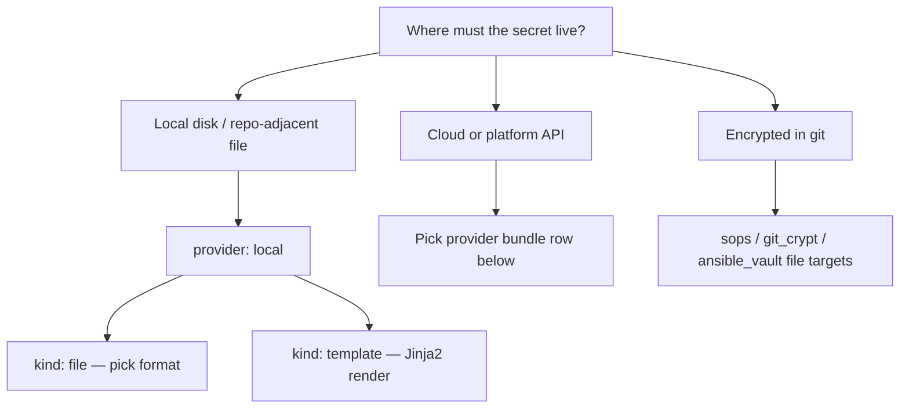

# SecretZero Author Skill

Use this skill whenever the task is to create or improve `Secretfile.yml` and related `.szvar` files.

## Mission

Produce high-quality, json-schema compliant SecretZero manifests that:

- Pass `secretzero validate` with zero issues.
- Keep secret discovery safe and contextless (no secret values requested or echoed).
- Intelligently break out environment variance into `.szvar` files.
- Bind provider-backed targets to least-privilege identity policies for AWS/Azure/other authenticated environments.

## Safety Rules (Non-Negotiable)

- Never ask for, copy, log, or output plaintext secret values.
- Discovery must use metadata only (`status`, `test`, provider identity fields), not secret retrieval.
- Do not run `secretzero get --reveal` in agent sessions.
- If provider identity evidence is missing, mark policy confidence as low and require human confirmation.

## Install / Verify

Preferred:

```bash
uv tool install -U "secretzero[all]"
```

Targeted extras (install only what you author against):

| Bundle / area | Extra |
|---------------|--------|
| AWS | `secretzero[aws]` |
| Azure + Key Vault | `secretzero[azure]` |
| Entra Agent ID | `secretzero[entra_agent_id]` |
| Vault | `secretzero[vault]` |
| GitHub | `secretzero[github]` |
| GitLab | `secretzero[gitlab]` |
| Jenkins | `secretzero[jenkins]` |
| Kubernetes | `secretzero[kubernetes]` |
| Ansible Vault file | `secretzero[ansible_vault]` |
| Infisical (read) | `secretzero[infisical]` |
| Vercel | `secretzero[vercel]` |
| SOPS / git-crypt | core package (no extra) |

Verify:

```bash
secretzero --help
secretzero validate --help
secretzero list providers
secretzero list targets
```

**Live bundle matrix:** `docs/reference/provider-bundles-auto.md` (regenerate with `task docs:generate:provider-bundles` after adding bundles).

---

## Decision map: where should this secret go?

Start with the **destination**, then pick **provider → target kind → generator kind**.



### Local provider (`provider: local`)

No `providers:` entry required. Use for dev, CI artifacts, Terraform var files, and blueprint metadata sidecars.

| You need | `kind` | `config` highlights |
|----------|--------|---------------------|
| `.env` / `TF_VAR_*` workflows | `file` | `format: dotenv`, `path: .env`, `merge: true` |
| JSON/YAML/TOML config on disk | `file` | `format: json` \| `yaml` \| `toml` |
| **Terraform HCL** `terraform.tfvars` | `file` | `format: tfvars`, `path: …/*.tfvars`, `merge: true`, optional `key:` for TF variable name |
| Terraform **JSON** var file | `file` | `format: json`, `path: …/*.tfvars.json` |
| Rendered multi-secret file | `template` | `template_path`, `output_path` |

**tfvars v1 limits:** flat `name = "string"` only; gitignore `*.tfvars`; use `key` when manifest secret name ≠ Terraform variable name. See `examples/terraform-tfvars/`.

### Provider bundles (sync targets)

| Destination | `providers:` kind | `kind` (target) | Typical `secrets[].kind` (generator) | Notes |
|-------------|-------------------|-----------------|--------------------------------------|-------|
| AWS SSM Parameter | `aws` | `ssm_parameter` | `random_password`, `random_string`, `static` | Optional `config.format: json` for structured payloads |
| AWS Secrets Manager | `aws` | `secrets_manager` | same | same |
| Azure Key Vault | `azure` | `azure_keyvault` or `key_vault` | same + `azure_app_reg` for app-reg-shaped static | Bind `provider_identity` on tenant/subscription |
| HashiCorp Vault KV | `vault` | `vault_kv` or `kv` | same | Token/ambient auth |
| GitHub Actions / repo secret | `github` | `github_secret` | `random_*`, `static`, **`github_pat`** | PAT uses dedicated generator |
| GitLab CI variable | `gitlab` | `gitlab_variable` | `random_*`, `static` | Project/group scoped via config |
| Jenkins credential | `jenkins` | `jenkins_credential` | `random_*`, `static` | |
| Kubernetes Secret | `kubernetes` | `kubernetes_secret` | `random_*`, `static` | |
| K8s ExternalSecret (ESO) | `kubernetes` | `external_secret` | `random_*`, `static` | ESO-shaped sync |
| Vercel env var | `vercel` | `vercel_env` | `random_*`, `static` | `development` / `preview` / `production` |
| SOPS-encrypted file in repo | `sops` | `sops_file` | `random_*`, `static` | Unlock via SOPS; not plaintext in git |
| git-crypt filtered file | `git_crypt` | `git_crypt_file` | `random_*`, `static` | Requires git-crypt setup |
| Ansible Vault file | `ansible_vault` | `ansible_vault_file` | `random_*`, `static` | `secretzero[ansible_vault]` |
| **Entra Agent ID blueprint** | `entra-agent-id` | *(none — provider-only)* | **`entra-agent-blueprint`** | Graph lifecycle; often **also** `local`/`file`/`json` for metadata export |
| Infisical | `infisical` | *(none today)* | use **`source`** `provider_read` or import flows | Read/reference; not a write target |
| Keeper Password Manager | `keeper` | `keeper_record` | `random_*`, `static` | Read via `provider_read`; write/create/update vault records; rotate via sync |

### Core generators (any provider)

| `kind` | Use when |
|--------|----------|
| `random_password` | High-entropy password (length, charset in `config`) |
| `random_string` | API keys, tokens, alphanumeric secrets |
| `static` | Known value, human prompt, or `${VAR}` placeholder; dict leaves for multi-field |
| `script` | Generate via command (`zsh`, `ssh-keygen`, etc.) |
| `provider_backed` | Value created by provider API (advanced; prefer bundle-specific kinds when available) |

### Bundle-specific generators

| `kind` | Provider | Use when |
|--------|----------|----------|
| `azure_app_reg` | `azure` | Entra app registration fields (static-like prompting) |
| `github_pat` | `github` | Create GitHub PAT via API |
| `entra-agent-blueprint` | `entra-agent-id` | Microsoft Agent Identity blueprint + creds + optional child agents |

**Static-like kinds** (`static`, `azure_app_reg`, …): agent sync may prompt per null leaf; prefer `.szvar` to pre-fill lane values.

### Multi-target pattern

Same secret, multiple destinations (common):

```yaml
targets:
  - provider: aws
    kind: ssm_parameter
    config: { name: /${env}/db/password }
  - provider: local
    kind: file
    config: { path: .env, format: dotenv, merge: true, key: DB_PASSWORD }
```

Attach `identity_policies` on cloud targets when sync must be lane-bound (see below).

---

## Authoring Workflow

1. **Load schema context**
   - Treat `Secretfile.schema.json` and `src/secretzero/models.py` as source of truth.
2. **Use the decision map**
   - Pick destination → provider/target → generator before writing YAML.
3. **Model whole secrets first**
   - One logical secret per `secrets[]` entry unless a true multi-field bundle is needed.
4. **Select generator intentionally**
   - Prefer `random_password`, `random_string`, `static` (or static-like kinds) before `script` / `provider_backed`.
5. **Map explicit targets**
   - Every secret has clear targets unless intentionally deferred (e.g. Entra blueprint metadata-only phase).
6. **Break out environment variance**
   - Keep structural defaults in `Secretfile.yml`.
   - Move lane-specific values to `*.szvar` files (`dev.szvar`, `staging.szvar`, `prod.szvar`).
7. **Apply identity guardrails**
   - Add `kind: provider_identity` policies and attach with `identity_policies` where needed.
8. **Validate in loop**
   - `secretzero validate`
   - `secretzero render` (if interpolation/templating is used)
   - `secretzero sync --dry-run --var-file <lane>.szvar`

## Environment Breakout Heuristics (`.szvar`)

Prefer `.szvar` breakout when values differ by deployment lane:

- Target names/paths (`/${env}/...`)
- Regions, accounts, tenants, namespaces
- Role/session specific selectors
- Non-structural per-lane toggles
- Pre-filled `static` / `azure_app_reg` leaves (avoid re-prompts)

Keep in manifest:

- Secret definitions (`name`, `kind`, generator config shape)
- Provider aliases and auth mode intent
- Policy object structure

Pattern:

```yaml
variables:
  env: dev
  aws_region: us-east-1
```

`dev.szvar`:

```yaml
env: dev
aws_region: us-east-1
```

`prod.szvar`:

```yaml
env: prod
aws_region: us-west-2
```

## Contextless Secret Discovery (Safe Mode)

Use only discovery commands that return metadata:

```bash
secretzero status --format json
secretzero test --verbose --format json
secretzero list providers
secretzero list targets
```

Derive policy candidates from actor/auth metadata (account, region, arn, tenant_id, subscription_id, namespace, etc.), never from secret contents.

## Target Policy Binding Guidance

- **AWS**: constrain `account` and `region` first; optionally constrain role/arn patterns.
- **Azure**: constrain `tenant_id` and, when available, `subscription_id`.
- **Other providers**: bind to strongest stable identity fields exposed by `get_actor_info()`.
- Avoid broad `*` or permissive regex unless explicitly approved.

Example:

```yaml
policies:
  aws_prod_identity:
    kind: provider_identity
    providers: [aws]
    match: all
    rules:
      - field: account
        glob: "111111111111"
      - field: region
        glob: us-east-1
```

## Related skills & examples

| Topic | Location |
|-------|----------|
| Agent sync / vectors | `skills/secretzero-agent/SKILL.md` |
| `.env`, ingest, `SZ_AGENT_MODE` | `skills/secretzero-handle/SKILL.md` |
| tfvars file target | `examples/terraform-tfvars/`, `.mex/patterns/file-target-tfvars.md` |
| Multi-env + AWS policies | `examples/multi-env-aws-policies/` |
| Entra Agent ID | `examples/entra-agent-id-blueprint.yml`, `docs/ENTRA-AGENT-ID.md` |

## Definition of Done

- `Secretfile.yml` is schema compliant and readable.
- Provider/target/generator choices match the decision map (or document intentional exceptions).
- `secretzero validate` exits cleanly.
- `.szvar` files cover lane variance without duplicating manifest structure.
- Provider-backed targets are bound to least-privilege identity policies where supported.
- No plaintext secret material appears in prompts, logs, files, or responses.
